# Documento de Arquitectura - Plantilla para Proyectos Flask

## 📋 Índice

1. [Visión General del Sistema](#visión-general-del-sistema)
2. [Arquitectura de Alto Nivel](#arquitectura-de-alto-nivel)
3. [Stack Tecnológico](#stack-tecnológico)
4. [Estructura del Proyecto](#estructura-del-proyecto)
5. [Componentes Principales](#componentes-principales)
6. [Módulos Especializados](#módulos-especializados)
7. [Patrones de Diseño](#patrones-de-diseño)
8. [Flujo de Datos](#flujo-de-datos)
9. [Integración con Supabase](#integración-con-supabase)
10. [APIs y Endpoints](#apis-y-endpoints)
11. [Frontend y Templates](#frontend-y-templates)
12. [Configuración y Entornos](#configuración-y-entornos)
13. [Seguridad](#seguridad)
14. [Escalabilidad](#escalabilidad)
15. [Deployment](#deployment)
16. [Monitoreo y Logging](#monitoreo-y-logging)

---

## 1. Visión General del Sistema

Esta arquitectura está diseñada para aplicaciones web modernas desarrolladas en Flask con una estructura simplificada y escalable. El sistema proporciona una base sólida para gestionar datos de manera eficiente, ofreciendo tanto una interfaz web como APIs RESTful.

### Características Principales

- **Arquitectura Simplificada**: Implementa una estructura directa con separación clara de responsabilidades usando prefijos
- **Base de Datos Cloud**: Integración completa con Supabase para persistencia de datos
- **APIs RESTful**: Endpoints bien documentados para integración externa
- **Interfaz Web Moderna**: Frontend responsivo con Bootstrap 5 puro (sin customizaciones)
- **Configuración Flexible**: Soporte para múltiples entornos de desarrollo
- **Sistema de Prefijos**: Organización clara por capas funcionales
- **Módulos Especializados**: Arquitectura modular para dominios de negocio específicos

### Objetivos del Sistema

1. **Gestión de Datos**: Almacenamiento y consulta de información estructurada
2. **Modularidad**: Separación clara por dominios de negocio
3. **Escalabilidad**: Arquitectura preparada para crecimiento horizontal
4. **Mantenibilidad**: Código organizado con convenciones claras y prefijos
5. **Extensibilidad**: Facilidad para agregar nuevas funcionalidades
6. **Reutilización**: Base arquitectónica reutilizable para diferentes proyectos

---

## 2. Arquitectura de Alto Nivel

```mermaid
graph TB
    subgraph "Cliente"
        A[Browser/Frontend]
        B[API Clients]
    end
    
    subgraph "🌐 API Layer"
        C[api_main.py - Main Routes]
        D[api_users.py - User Management]
        E[api_external.py - External APIs]
        F[api_storage.py - Storage Services]
    end
    
    subgraph "🌐 Routes Layer"
        G[routes_module_a.py - Module A]
        H[routes_module_b.py - Module B]
    end
    
    subgraph "💾 Data Layer"
        I[data_supabase.py - Database Operations]
    end
    
    subgraph "🔧 Service Layer"
        J[service_storage.py - Storage Operations]
        K[service_ai.py - AI Services]
        L[service_system_info.py - System Info]
    end
    
    subgraph "⚙️ Configuration Layer"
        M[config_app.py - App Configuration]
    end
    
    subgraph "🔧 Core Layer"
        N[core_config.py - Flask Configuration]
        O[core_logging.py - Logging System]
        P[__init__.py - Application Factory]
    end
    
    subgraph "🔧 Utilities Layer"
        Q[utils_messages.py - Message Formatting]
    end
    
    subgraph "External Services"
        R[Supabase Database]
        S[External APIs]
        T[Cloud Storage]
    end
    
    A --> C
    A --> D
    A --> G
    A --> H
    B --> C
    B --> D
    B --> E
    B --> G
    B --> H
    
    C --> I
    D --> I
    E --> I
    F --> I
    G --> I
    H --> I
    M --> I
    
    G --> J
    H --> J
    G --> K
    H --> K
    
    C --> O
    D --> O
    E --> O
    F --> O
    G --> O
    H --> O
    M --> O
    
    P --> C
    P --> D
    P --> E
    P --> F
    P --> G
    P --> H
    P --> I
    P --> J
    P --> K
    P --> L
    P --> M
    P --> N
    P --> O
    P --> Q
    
    I --> R
    E --> S
    F --> T
    J --> T
```



### Principios Arquitectónicos

1. **Separación por Prefijos**: Cada capa tiene un prefijo que identifica su rol
2. **Modularidad por Dominio**: Módulos especializados por áreas de negocio
3. **Configuración Externa**: Parámetros externalizados en variables de entorno
4. **Escalabilidad Horizontal**: Diseño preparado para múltiples instancias
5. **Mantenibilidad**: Estructura clara y predecible
6. **Reutilización de Servicios**: Servicios compartidos entre módulos

---

## 3. Stack Tecnológico

### Backend Core
```python
Flask==3.0.0              # Framework web principal
Werkzeug==3.0.1           # WSGI utilities
Jinja2==3.1.2             # Motor de templates
MarkupSafe==2.1.3         # Seguridad en templates
itsdangerous==2.1.2       # Firmado criptográfico
click==8.1.7              # CLI utilities
blinker==1.7.0            # Señales y eventos
```

### Base de Datos
```python
supabase==2.9.1           # Cliente oficial de Supabase
```

### Configuración
```python
python-dotenv==1.0.0      # Gestión de variables de entorno
```

### Integraciones Externas
```python
requests==2.31.0          # Cliente HTTP para APIs externas
```

### Análisis de Datos (Opcional)
```python
pandas==2.1.4             # Análisis de datos
numpy==1.24.3             # Computación numérica
scikit-learn==1.3.2       # Machine learning
```

### Frontend
- **Bootstrap 5.3.2 Puro**: Framework CSS responsivo sin customizaciones
- **Bootstrap Icons**: Iconografía moderna
- **Chart.js**: Visualización de gráficos (opcional)
- **JavaScript ES6+ Mínimo**: Interactividad básica del cliente

### Infraestructura
- **Supabase**: Base de datos PostgreSQL en la nube
- **Cloud Storage**: Almacenamiento de archivos en la nube
- **External APIs**: Integración con servicios externos
- **Python 3.13**: Runtime principal

---

## 4. Estructura del Proyecto

```
project/
├── app/                           # Código principal de la aplicación
│   ├── __init__.py               # Factory pattern Flask
│   ├── api_main.py               # 🌐 Rutas principales y API básica
│   ├── api_users.py              # 🌐 Gestión de usuarios
│   ├── api_external.py           # 🌐 Integración APIs externas
│   ├── api_storage.py            # 🌐 Configuración almacenamiento
│   ├── routes_module_a.py        # 🌐 Registro de blueprints módulo A
│   ├── routes_module_b.py        # 🌐 Registro de blueprints módulo B
│   ├── routes/                   # Módulos especializados
│   │   ├── module_a/            # Módulo A
│   │   │   ├── web.py           # Rutas web del módulo A
│   │   │   ├── api_feature_1.py # API feature 1
│   │   │   ├── api_feature_2.py # API feature 2
│   │   │   └── api_feature_n.py # API feature N
│   │   └── module_b/            # Módulo B
│   │       ├── web.py           # Rutas web del módulo B
│   │       ├── api_feature_1.py # API feature 1
│   │       ├── api_feature_2.py # API feature 2
│   │       └── api_feature_n.py # API feature N
│   ├── service_storage.py        # 🔧 Servicio de almacenamiento
│   ├── service_ai.py             # 🔧 Servicios de IA
│   ├── service_system_info.py    # 🔧 Información del sistema
│   ├── data_supabase.py          # 💾 Operaciones de base de datos
│   ├── config_app.py             # ⚙️ Configuración de la aplicación
│   ├── utils_messages.py         # 🔧 Utilidades de mensajes estandarizados
│   ├── core_config.py            # 🔧 Configuración de Flask
│   └── core_logging.py           # 🔧 Sistema de logging
├── templates/                    # Templates Jinja2
│   ├── base.html                # Template base
│   ├── index.html               # Página principal
│   ├── module_a/                # Templates del módulo A
│   │   ├── index.html           # Dashboard del módulo A
│   │   ├── feature_1.html       # Feature 1
│   │   ├── feature_2.html       # Feature 2
│   │   └── feature_n.html       # Feature N
│   ├── module_b/                # Templates del módulo B
│   │   ├── index.html           # Dashboard del módulo B
│   │   ├── feature_1.html       # Feature 1
│   │   ├── feature_2.html       # Feature 2
│   │   └── feature_n.html       # Feature N
│   └── [otros templates]        # Configuración, usuarios, etc.
├── static/                      # Archivos estáticos
│   ├── css/                     # Estilos CSS
│   │   ├── module_a/           # Estilos específicos del módulo A
│   │   └── module_b/           # Estilos específicos del módulo B
│   └── js/                      # JavaScript
│       ├── module_a/           # Scripts del módulo A
│       │   ├── feature_1/      # Scripts de feature 1
│       │   ├── feature_2/      # Scripts de feature 2
│       │   └── utils.js        # Utilidades compartidas
│       └── module_b/           # Scripts del módulo B
│           ├── feature_1/      # Scripts de feature 1
│           ├── feature_2/      # Scripts de feature 2
│           └── utils.js        # Utilidades compartidas
├── docs/                        # Documentación
│   ├── arquitectura.md         # Arquitectura detallada
│   ├── database_schema.md      # Esquema de base de datos
│   └── DEV/                    # Documentación de desarrollo
├── logs/                        # Archivos de log
├── migrations/                  # Migraciones de base de datos
├── app.py                       # Punto de entrada
├── requirements.txt             # Dependencias Python
└── .env                        # Variables de entorno
```

### Sistema de Prefijos

#### Convenciones de Nombres en `/app`

| Prefijo | Rol | Descripción | Archivos |
|---------|-----|-------------|----------|
| **`api_`** | 🌐 **API Layer** | Archivos que exponen APIs y rutas web generales | `api_main.py`, `api_users.py`, `api_external.py`, `api_storage.py` |
| **`routes_`** | 🌐 **Routes Layer** | Archivos de registro de blueprints especializados | `routes_module_a.py`, `routes_module_b.py` |
| **`service_`** | 🔧 **Service Layer** | Servicios de lógica de negocio | `service_storage.py`, `service_ai.py`, `service_system_info.py` |
| **`data_`** | 💾 **Data Layer** | Archivos que manejan datos y bases de datos | `data_supabase.py` |
| **`config_`** | ⚙️ **Configuration Layer** | Archivos de configuración de aplicación | `config_app.py` |
| **`utils_`** | 🔧 **Utilities Layer** | Utilidades y helpers | `utils_messages.py` |
| **`core_`** | 🔧 **Core Layer** | Archivos fundamentales del sistema | `core_config.py`, `core_logging.py` |

#### Beneficios del Sistema de Prefijos

1. **Organización Visual**: Identificación inmediata del rol de cada archivo
2. **Agrupación Lógica**: Archivos se agrupan naturalmente por funcionalidad
3. **Escalabilidad**: Fácil agregar nuevos archivos siguiendo el patrón
4. **Mantenimiento**: Reduce confusión sobre ubicación de funcionalidades
5. **Colaboración**: Estructura comprensible para nuevos desarrolladores

---

## 5. Componentes Principales

### 5.1 Application Factory (`app/__init__.py`)

```python
def create_app(config_name=None):
    """Application Factory Pattern for Flask app creation"""
    
    # Determine configuration
    if config_name is None:
        config_name = os.getenv('FLASK_ENV', 'development')
    
    # Create Flask app
    app = Flask(__name__,
                template_folder='../templates',
                static_folder='../static')
    
    # Load configuration
    app.config.from_object(config[config_name])
    config[config_name].init_app(app)
    
    # Setup logging
    setup_logging(app, config_name)
    
    # Register blueprints from simplified modules
    from app.api_main import main_bp, api_bp
    from app.api_users import user_bp, user_web_bp
    from app.data_supabase import supabase_bp
    from app.config_app import config_bp, config_api_bp
    from app.api_external import external_bp
    from app.routes_module_a import register_module_a_blueprints
    from app.routes_module_b import register_module_b_blueprints
    from app.api_storage import storage_bp, storage_api_bp
    
    app.register_blueprint(main_bp)
    app.register_blueprint(api_bp)
    app.register_blueprint(user_bp)
    app.register_blueprint(user_web_bp)
    app.register_blueprint(supabase_bp)
    app.register_blueprint(config_bp)
    app.register_blueprint(config_api_bp)
    app.register_blueprint(external_bp, url_prefix='/external')
    register_module_a_blueprints(app)
    register_module_b_blueprints(app)
    app.register_blueprint(storage_bp)
    app.register_blueprint(storage_api_bp)
    
    return app
```

**Responsabilidades:**
- Inicialización de la aplicación Flask
- Configuración de rutas de templates y archivos estáticos
- Registro de todos los blueprints (generales y especializados)
- Configuración de middleware y error handlers

### 5.2 Data Layer (`app/data_supabase.py`)

```python
class SupabaseService:
    """Service class for Supabase database operations."""
    
    def __init__(self):
        self.url: str = os.getenv('SUPABASE_URL', '')
        self.key: str = os.getenv('SUPABASE_ANON_KEY', '')
        self.client: Optional[Client] = None
        self.logger = get_logger(__name__)
        
        self._initialize_client()
    
    def test_connection(self) -> Dict[str, Any]:
        """Test the connection to Supabase database."""
        
    def insert_data(self, table_name: str, data: Dict[str, Any]) -> Dict[str, Any]:
        """Insert data into a table."""
        
    def select_data(self, table_name: str, filters: Optional[Dict[str, Any]] = None, 
                   columns: Optional[List[str]] = None, limit: Optional[int] = None) -> Dict[str, Any]:
        """Select data from a table with optional filters."""
        
    def update_data(self, table_name: str, data: Dict[str, Any], 
                   filters: Dict[str, Any]) -> Dict[str, Any]:
        """Update data in a table."""
        
    def delete_data(self, table_name: str, filters: Dict[str, Any]) -> Dict[str, Any]:
        """Delete data from a table."""
        
    def execute_query(self, query: str, params: Optional[tuple] = None) -> Dict[str, Any]:
        """Execute raw SQL query with parameters."""
        
    def call_rpc(self, function_name: str, params: Optional[Dict[str, Any]] = None) -> Dict[str, Any]:
        """Call a PostgreSQL RPC function."""
```

### 5.3 Utilities Layer (`app/utils_messages.py`)

```python
class MessageFormatter:
    """Clase para formatear mensajes de manera consistente."""
    
    @staticmethod
    def success_response(message, data=None):
        """Crear respuesta de éxito estandarizada."""
        return {
            'success': True,
            'message': message,
            'data': data
        }
    
    @staticmethod
    def error_response(message, data=None):
        """Crear respuesta de error estandarizada."""
        return {
            'success': False,
            'message': message,
            'data': data
        }

class Messages:
    """Constantes de mensajes estandarizados para la aplicación."""
    
    # Mensajes generales
    CONNECTION_SUCCESSFUL = "Connection established successfully"
    CONFIGURATION_SAVED = "Configuration saved successfully"
    
    # Mensajes de módulos (personalizar según necesidades)
    ITEM_CREATED = "Item created successfully"
    ITEM_UPDATED = "Item updated successfully"
    ITEM_DELETED = "Item deleted successfully"
    
    # Mensajes de error comunes
    ERROR_GENERAL = "An error occurred while processing the request"
    ERROR_NOT_FOUND = "Requested resource not found"
    ERROR_INVALID_DATA = "Invalid data provided"
    ERROR_UNAUTHORIZED = "Unauthorized access"
    ERROR_CONNECTION = "Connection error occurred"
    ERROR_DATABASE = "Database operation failed"
```

---

## 6. Módulos Especializados

### 6.1 Estructura de Módulos

Los módulos especializados siguen una estructura consistente que permite la separación clara de responsabilidades por dominio de negocio.

#### Estructura Base de un Módulo

```
routes/
└── module_name/
    ├── web.py                # 🌐 Rutas web principales
    ├── api_feature_1.py      # 🌐 API de feature 1
    ├── api_feature_2.py      # 🌐 API de feature 2
    └── api_feature_n.py      # 🌐 API de feature N
```

#### Registro de Blueprints (`routes_module_name.py`)

```python
# Blueprint principal para páginas web
module_bp = Blueprint('module_name', __name__, url_prefix='/module_name')
module_bp.register_blueprint(module_web_bp)

# Blueprint para APIs
module_api_bp = Blueprint('module_name_api', __name__, url_prefix='/api/module_name')
module_api_bp.register_blueprint(feature_1_api_bp, url_prefix='/feature_1')
module_api_bp.register_blueprint(feature_2_api_bp, url_prefix='/feature_2')
module_api_bp.register_blueprint(feature_n_api_bp, url_prefix='/feature_n')

def register_module_blueprints(app):
    """Register all module blueprints with the Flask app."""
    app.register_blueprint(module_bp)
    app.register_blueprint(module_api_bp)
```

### 6.2 Convenciones de Módulos

#### Rutas Web (`routes/module_name/web.py`)
- Páginas principales del módulo
- Renderizado de templates
- Navegación entre vistas
- Formularios web

#### APIs de Features (`routes/module_name/api_feature_*.py`)
- Endpoints REST específicos por feature
- Operaciones CRUD
- Validación de datos
- Respuestas JSON estructuradas

### 6.3 Plantilla de Módulo

#### Archivo de Registro (`routes_module_template.py`)
```python
from flask import Blueprint
from app.routes.module_template.web import module_template_web_bp
from app.routes.module_template.api_feature_1 import feature_1_api_bp
from app.routes.module_template.api_feature_2 import feature_2_api_bp

# Blueprint principal para páginas web
module_template_bp = Blueprint('module_template', __name__, url_prefix='/module_template')
module_template_bp.register_blueprint(module_template_web_bp)

# Blueprint para APIs
module_template_api_bp = Blueprint('module_template_api', __name__, url_prefix='/api/module_template')
module_template_api_bp.register_blueprint(feature_1_api_bp, url_prefix='/feature_1')
module_template_api_bp.register_blueprint(feature_2_api_bp, url_prefix='/feature_2')

def register_module_template_blueprints(app):
    """Register all module template blueprints with the Flask app."""
    app.register_blueprint(module_template_bp)
    app.register_blueprint(module_template_api_bp)
```

#### Rutas Web (`routes/module_template/web.py`)
```python
from flask import Blueprint, render_template, request, redirect, url_for
from app.utils_messages import MessageFormatter, Messages
from app.core_logging import get_logger

module_template_web_bp = Blueprint('module_template_web', __name__)
logger = get_logger(__name__)

@module_template_web_bp.route('/')
def index():
    """Dashboard principal del módulo."""
    return render_template('module_template/index.html')

@module_template_web_bp.route('/feature_1')
def feature_1():
    """Vista de feature 1."""
    return render_template('module_template/feature_1.html')

@module_template_web_bp.route('/feature_2')
def feature_2():
    """Vista de feature 2."""
    return render_template('module_template/feature_2.html')
```

#### API de Feature (`routes/module_template/api_feature_1.py`)
```python
from flask import Blueprint, request, jsonify
from app.data_supabase import SupabaseService
from app.utils_messages import MessageFormatter, Messages
from app.core_logging import get_logger

feature_1_api_bp = Blueprint('feature_1_api', __name__)
logger = get_logger(__name__)
supabase_service = SupabaseService()

@feature_1_api_bp.route('/', methods=['GET'])
def get_items():
    """Obtener lista de items."""
    try:
        # Lógica de negocio aquí
        result = supabase_service.select_data('table_name')
        
        if result['success']:
            return jsonify(MessageFormatter.success_response(
                "Items retrieved successfully", 
                result['data']
            ))
        else:
            return jsonify(MessageFormatter.error_response(
                result['message']
            )), 400
            
    except Exception as e:
        logger.error(f"Error getting items: {str(e)}")
        return jsonify(MessageFormatter.error_response(
            Messages.ERROR_GENERAL
        )), 500

@feature_1_api_bp.route('/', methods=['POST'])
def create_item():
    """Crear nuevo item."""
    try:
        data = request.get_json()
        
        # Validación de datos
        if not data:
            return jsonify(MessageFormatter.error_response(
                Messages.ERROR_INVALID_DATA
            )), 400
        
        # Lógica de creación
        result = supabase_service.insert_data('table_name', data)
        
        if result['success']:
            return jsonify(MessageFormatter.success_response(
                Messages.ITEM_CREATED, 
                result['data']
            )), 201
        else:
            return jsonify(MessageFormatter.error_response(
                result['message']
            )), 400
            
    except Exception as e:
        logger.error(f"Error creating item: {str(e)}")
        return jsonify(MessageFormatter.error_response(
            Messages.ERROR_GENERAL
        )), 500

@feature_1_api_bp.route('/<int:item_id>', methods=['PUT'])
def update_item(item_id):
    """Actualizar item existente."""
    try:
        data = request.get_json()
        
        # Validación de datos
        if not data:
            return jsonify(MessageFormatter.error_response(
                Messages.ERROR_INVALID_DATA
            )), 400
        
        # Lógica de actualización
        result = supabase_service.update_data(
            'table_name', 
            data, 
            {'id': item_id}
        )
        
        if result['success']:
            return jsonify(MessageFormatter.success_response(
                Messages.ITEM_UPDATED, 
                result['data']
            ))
        else:
            return jsonify(MessageFormatter.error_response(
                result['message']
            )), 400
            
    except Exception as e:
        logger.error(f"Error updating item {item_id}: {str(e)}")
        return jsonify(MessageFormatter.error_response(
            Messages.ERROR_GENERAL
        )), 500

@feature_1_api_bp.route('/<int:item_id>', methods=['DELETE'])
def delete_item(item_id):
    """Eliminar item."""
    try:
        result = supabase_service.delete_data(
            'table_name', 
            {'id': item_id}
        )
        
        if result['success']:
            return jsonify(MessageFormatter.success_response(
                Messages.ITEM_DELETED
            ))
        else:
            return jsonify(MessageFormatter.error_response(
                result['message']
            )), 400
            
    except Exception as e:
        logger.error(f"Error deleting item {item_id}: {str(e)}")
        return jsonify(MessageFormatter.error_response(
            Messages.ERROR_GENERAL
        )), 500
```

---

## 7. Patrones de Diseño

### 7.1 Factory Pattern
**Ubicación**: `app/__init__.py`
- Creación controlada de la aplicación Flask
- Configuración centralizada
- Facilita testing y múltiples entornos

### 7.2 Blueprint Pattern
**Ubicación**: Archivos `api_*.py` y `routes_*.py`
- Modularización de rutas por funcionalidad
- Separación de responsabilidades en archivos dedicados
- Escalabilidad horizontal

### 7.3 Service Layer Pattern
**Ubicación**: Archivos `service_*.py` y clases service en módulos
- Encapsulación de lógica de negocio
- Reutilización de código
- Testabilidad mejorada

### 7.4 Singleton Pattern
**Ubicación**: `SupabaseService` en `data_supabase.py`
- Una sola instancia del servicio de base de datos
- Reutilización de conexiones
- Optimización de recursos

### 7.5 Prefix-Based Organization Pattern
**Ubicación**: Estructura de archivos en `/app`
- Organización por capas funcionales
- Identificación inmediata del propósito
- Escalabilidad de la estructura

### 7.6 Module Pattern
**Ubicación**: Módulos especializados en `/routes`
- Separación por dominio de negocio
- Reutilización de servicios compartidos
- Mantenimiento independiente

---

## 8. Flujo de Datos

### 8.1 Petición Web Estándar
```
Cliente → Flask → Blueprint (routes/*/web.py) → Template → Respuesta HTML
```

### 8.2 Petición API
```
Cliente → Flask → Blueprint (routes/*/api_*.py) → Service → data_supabase.py → Supabase → JSON Response
```

### 8.3 Operaciones de Módulos
```
HTTP Request → routes/module_name/*.py → SupabaseService → PostgreSQL → Processing → Response
```

### 8.4 Configuración de Aplicación
```
HTTP Request → config_app.py → ConfigService → data_supabase.py → Supabase → Configuration Response
```

### 8.5 Servicios Externos
```
HTTP Request → api_external.py → External Service → Processing → Response
```

---

## 9. Integración con Supabase

### 9.1 Configuración

**Archivo**: `.env`
```env
SUPABASE_URL=https://your-project.supabase.co
SUPABASE_ANON_KEY=your-anon-key
```

### 9.2 Funcionalidades Implementadas

1. **Test de Conexión**: Verificación de conectividad
2. **CRUD Completo**: Create, Read, Update, Delete
3. **Gestión de Configuración**: Almacenamiento de settings de aplicación
4. **Gestión de Usuarios**: Sistema completo de usuarios
5. **Gestión de API Keys**: Almacenamiento seguro de claves externas
6. **Funciones RPC**: Llamadas a funciones PostgreSQL personalizadas
7. **Consultas Raw SQL**: Ejecución de SQL personalizado
8. **Manejo de Errores**: Respuestas estructuradas

### 9.3 Estructura de Respuestas

```json
{
    "success": true,
    "message": "Operation completed successfully",
    "data": {...}
}
```

### 9.4 Tablas Base del Sistema

#### Configuración
- **`app_config`**: Configuración de la aplicación
- **`external_keys`**: Claves API de servicios externos
- **`external_services`**: Servicios configurados

#### Usuarios
- **`users`**: Gestión de usuarios del sistema

#### Módulos Específicos
- **`module_a_*`**: Tablas específicas del módulo A
- **`module_b_*`**: Tablas específicas del módulo B

---

## 10. APIs y Endpoints

### 10.1 Estructura de APIs

Todas las APIs siguen el patrón RESTful con respuestas JSON estructuradas:

```json
{
    "success": boolean,
    "message": "string",
    "data": object|array
}
```

### 10.2 Endpoints Base del Sistema

#### Main API (`/api`) - `api_main.py`
- `GET /api/` - Información de la API
- `GET /api/health` - Health check
- `GET /api/data` - Datos del sistema

#### Users API (`/api/users`) - `api_users.py`
- `GET /api/users/` - Listar usuarios
- `POST /api/users/` - Crear usuario
- `GET /api/users/{id}` - Obtener usuario
- `PUT /api/users/{id}` - Actualizar usuario
- `DELETE /api/users/{id}` - Eliminar usuario
- `GET /user/profile` - Página de perfil

#### Supabase API (`/api/supabase`) - `data_supabase.py`
- `GET /api/supabase/test` - Test de conexión
- `GET /api/supabase/tables` - Listar tablas
- `GET /api/supabase/{table}` - Obtener datos de tabla
- `POST /api/supabase/{table}` - Insertar datos
- `PUT /api/supabase/{table}` - Actualizar datos
- `DELETE /api/supabase/{table}` - Eliminar datos

#### Configuration API (`/api/config`) - `config_app.py`
- `GET /api/config/` - Todas las configuraciones
- `GET /api/config/app` - Configuraciones principales
- `GET /api/config/{key}` - Configuración específica
- `POST /api/config/` - Actualizar configuraciones
- `PUT /api/config/{key}` - Establecer configuración
- `GET /config/` - Página de configuración
- `POST /config/update` - Actualizar vía formulario

#### External API (`/external`) - `api_external.py`
- `GET /external/` - Página de configuración
- `GET /external/api/keys` - Listar API keys
- `POST /external/api/keys` - Guardar API key
- `POST /external/api/keys/{id}/test` - Probar API key
- `DELETE /external/api/keys/{id}` - Eliminar API key

#### Storage API (`/storage`) - `api_storage.py`
- `GET /storage/` - Página de configuración
- `GET /storage/api/config` - Obtener configuración
- `POST /storage/api/config` - Guardar configuración
- `POST /storage/api/test` - Probar conexión

### 10.3 Plantilla de Endpoints para Módulos

#### Módulo API (`/api/module_name`) - `routes_module_name.py`

##### Feature 1 (`/api/module_name/feature_1`)
- `GET /` - Obtener items
- `POST /` - Crear item
- `PUT /{id}` - Actualizar item
- `DELETE /{id}` - Eliminar item

##### Feature 2 (`/api/module_name/feature_2`)
- `GET /` - Obtener items
- `POST /` - Crear item
- `PUT /{id}` - Actualizar item
- `DELETE /{id}` - Eliminar item

---

## 11. Frontend y Templates

### 11.1 Filosofía de Diseño

**Bootstrap Puro**: El proyecto utiliza exclusivamente Bootstrap 5.3.2 sin ninguna customización CSS adicional. Esta decisión arquitectónica garantiza:

- **Consistencia**: Interfaz homogénea y predecible
- **Mantenibilidad**: Sin CSS personalizado que mantener
- **Performance**: Carga optimizada sin CSS redundante
- **Simplicidad**: Diseño limpio usando solo clases Bootstrap estándar

### 11.2 Estructura de Templates

```
templates/
├── base.html                # Template base con Bootstrap CDN
├── index.html               # Página principal
├── module_a/                # Templates del módulo A
│   ├── index.html           # Dashboard del módulo A
│   ├── feature_1.html       # Feature 1
│   ├── feature_2.html       # Feature 2
│   └── feature_n.html       # Feature N
├── module_b/                # Templates del módulo B
│   ├── index.html           # Dashboard del módulo B
│   ├── feature_1.html       # Feature 1
│   ├── feature_2.html       # Feature 2
│   └── feature_n.html       # Feature N
├── config.html              # Configuración de aplicación
├── external.html            # Configuración de servicios externos
├── storage.html             # Configuración de almacenamiento
├── user_profile.html        # Perfil de usuario
└── errors/
    ├── 404.html            # Página de error 404
    └── 500.html            # Página de error 500
```

### 11.3 Template Base

```html
<!DOCTYPE html>
<html lang="es">
<head>
    <meta charset="UTF-8">
    <meta name="viewport" content="width=device-width, initial-scale=1.0">
    <title></title>
    
    <!-- Bootstrap CSS -->
    <link href="https://cdn.jsdelivr.net/npm/bootstrap@5.3.2/dist/css/bootstrap.min.css" rel="stylesheet">
    <link href="https://cdn.jsdelivr.net/npm/bootstrap-icons@1.11.1/font/bootstrap-icons.css" rel="stylesheet">
    
    <!-- Chart.js (opcional) -->
    <script src="https://cdn.jsdelivr.net/npm/chart.js"></script>
    
    
</head>
<body>
    <!-- Navigation -->
    <nav class="navbar navbar-expand-lg navbar-dark bg-primary">
        <div class="container-fluid">
            <a class="navbar-brand" href="{{ url_for('main.index') }}">
                <i class="bi bi-gear-fill"></i> Project Name
            </a>
            
            <div class="navbar-nav ms-auto">
                <a class="nav-link" href="{{ url_for('main.index') }}">
                    <i class="bi bi-house-fill"></i> Inicio
                </a>
                <!-- Módulos dinámicos -->
                
                
                <!-- Configuración -->
                <div class="nav-item dropdown">
                    <a class="nav-link dropdown-toggle" href="#" role="button" data-bs-toggle="dropdown">
                        <i class="bi bi-gear-fill"></i> Configuración
                    </a>
                    <ul class="dropdown-menu">
                        <li><a class="dropdown-item" href="{{ url_for('config.index') }}">General</a></li>
                        <li><a class="dropdown-item" href="{{ url_for('external.index') }}">Servicios Externos</a></li>
                        <li><a class="dropdown-item" href="{{ url_for('storage.index') }}">Almacenamiento</a></li>
                    </ul>
                </div>
            </div>
        </div>
    </nav>

    <!-- Main Content -->
    <div class="container-fluid">
        <div class="row">
            <!-- Sidebar -->
            <nav class="col-md-2 d-md-block bg-light sidebar">
                <div class="position-sticky pt-3">
                    
                </div>
            </nav>

            <!-- Main Content Area -->
            <main class="col-md-10 ms-sm-auto px-md-4">
                
                    
                        
                            <div class="alert alert-{{ 'danger' if category == 'error' else category }} alert-dismissible fade show mt-3" role="alert">
                                {{ message }}
                                <button type="button" class="btn-close" data-bs-dismiss="alert"></button>
                            </div>
                        
                    
                

                
            </main>
        </div>
    </div>

    <!-- Bootstrap JS -->
    <script src="https://cdn.jsdelivr.net/npm/bootstrap@5.3.2/dist/js/bootstrap.bundle.min.js"></script>
    
    
</body>
</html>
```

### 11.4 Navegación Dinámica

La navegación se adapta automáticamente según los módulos registrados:

```html
<!-- En templates de módulos -->

<div class="nav-item dropdown">
    <a class="nav-link dropdown-toggle" href="#" role="button" data-bs-toggle="dropdown">
        <i class="bi bi-module-icon"></i> Módulo A
    </a>
    <ul class="dropdown-menu">
        <li><a class="dropdown-item" href="{{ url_for('module_a.index') }}">Dashboard</a></li>
        <li><a class="dropdown-item" href="{{ url_for('module_a.feature_1') }}">Feature 1</a></li>
        <li><a class="dropdown-item" href="{{ url_for('module_a.feature_2') }}">Feature 2</a></li>
    </ul>
</div>

```

### 11.5 Componentes UI Estándar

- **Navigation**: Barra de navegación Bootstrap responsiva
- **Cards**: Contenedores de información con Bootstrap cards
- **Forms**: Formularios con validación Bootstrap
- **Tables**: Tablas responsivas para listados de datos
- **Modals**: Diálogos para confirmaciones y formularios
- **Alerts**: Mensajes de feedback con sistema Flash
- **Charts**: Gráficos con Chart.js para visualización de datos (opcional)
- **Dropdowns**: Menús desplegables para navegación
- **Badges**: Indicadores de estado y métricas

### 11.6 JavaScript

#### Estructura de Scripts
```
static/js/
├── messages.js              # Utilidades de mensajes
├── module_a/
│   ├── utils.js             # Utilidades compartidas
│   ├── feature_1/main.js    # Feature 1
│   ├── feature_2/main.js    # Feature 2
│   └── feature_n/main.js    # Feature N
└── module_b/
    ├── utils.js             # Utilidades compartidas
    ├── feature_1/main.js    # Feature 1
    ├── feature_2/main.js    # Feature 2
    └── feature_n/main.js    # Feature N
```

#### Funcionalidades JavaScript Base
- **Carga Dinámica**: Carga de datos vía AJAX
- **Validación de Formularios**: Validación client-side
- **Interactividad**: Eventos y manipulación DOM
- **Gráficos**: Integración con Chart.js (opcional)
- **Modales**: Gestión de diálogos Bootstrap
- **Filtros**: Filtrado dinámico de datos
- **Paginación**: Navegación de resultados

---

## 12. Configuración y Entornos

### 12.1 Variables de Entorno

```env
# Flask Configuration
FLASK_ENV=development
SECRET_KEY=your-secret-key
DEBUG=True
PORT=5000

# Supabase Configuration
SUPABASE_URL=https://your-project.supabase.co
SUPABASE_ANON_KEY=your-anon-key

# External Services Configuration
EXTERNAL_API_KEY=your-external-api-key

# Storage Configuration
STORAGE_KEY_ID=your-storage-key-id
STORAGE_KEY=your-storage-key
STORAGE_BUCKET=your-bucket-name
```

### 12.2 Configuración por Entornos

#### Development (`core_config.py`)
```python
class DevelopmentConfig(Config):
    DEBUG = True
    TESTING = False
```

#### Production (`core_config.py`)
```python
class ProductionConfig(Config):
    DEBUG = False
    TESTING = False
```

### 12.3 Gestión de Configuración Dinámica

El sistema permite configuración dinámica a través de la base de datos:

- **Interfaz Web**: `/config/` para gestión visual
- **API REST**: `/api/config/` para integración programática
- **Persistencia**: Almacenado en tabla `app_config` de Supabase
- **Cache**: Sistema de cache para optimización

---

## 13. Seguridad

### 13.1 Headers de Seguridad

```python
@app.after_request
def add_security_headers(response):
    response.headers['X-Content-Type-Options'] = 'nosniff'
    response.headers['X-Frame-Options'] = 'DENY'
    response.headers['X-XSS-Protection'] = '1; mode=block'
    response.headers['Content-Security-Policy'] = "default-src 'self' 'unsafe-inline' 'unsafe-eval' https://cdn.jsdelivr.net..."
    return response
```

### 13.2 Validación de Datos

- **Input Validation**: Validación en endpoints API
- **SQL Injection Protection**: ORM Supabase con parámetros
- **XSS Protection**: Templates Jinja2 con escape automático
- **CSRF Protection**: Tokens de seguridad en formularios

### 13.3 Gestión de Secretos

- **API Keys**: Almacenamiento seguro en Supabase con ofuscación
- **Environment Variables**: Configuración sensible en `.env`
- **Session Security**: Secret key para firmado de sesiones
- **Database Security**: RLS (Row Level Security) en Supabase

### 13.4 Aislamiento de Datos

- **Usuario/Contexto**: Separación por usuario/contexto según necesidades
- **Filtros de Seguridad**: Validación de acceso a datos
- **Logs de Auditoría**: Registro de operaciones críticas

---

## 14. Escalabilidad

### 14.1 Arquitectura Horizontal

- **Stateless Application**: Sin estado en memoria
- **Database Scaling**: Supabase maneja escalabilidad automática
- **Load Balancing Ready**: Compatible con múltiples instancias
- **Service Separation**: Servicios independientes por funcionalidad

### 14.2 Performance

- **Connection Pooling**: Singleton pattern para servicios
- **Caching Strategy**: Cache de configuración y datos frecuentes
- **Lazy Loading**: Carga bajo demanda de servicios
- **Optimized Queries**: Uso de funciones RPC para consultas complejas

### 14.3 Modularidad

- **Prefix System**: Fácil agregar nuevos módulos
- **Blueprint Architecture**: Separación clara de funcionalidades
- **Service Layer**: Lógica reutilizable y testeable
- **Domain Modules**: Módulos independientes por dominio

### 14.4 Optimizaciones por Tipo de Módulo

#### Módulos de Datos
- **RPC Functions**: Funciones PostgreSQL para cálculos complejos
- **Data Processing**: Pandas para análisis eficiente
- **Caching**: Cache de datos frecuentemente consultados

#### Módulos de Contenido
- **Batch Processing**: Procesamiento por lotes
- **Async Operations**: Operaciones asíncronas para servicios externos
- **File Streaming**: Manejo eficiente de archivos grandes

---

## 15. Deployment

### 15.1 Preparación para Producción

```bash
# Instalar dependencias
pip install -r requirements.txt

# Configurar variables de entorno
export FLASK_ENV=production
export SECRET_KEY=production-secret-key

# Ejecutar aplicación
python app.py
```

### 15.2 Docker (Opcional)

```dockerfile
FROM python:3.13-slim
WORKDIR /app
COPY requirements.txt .
RUN pip install -r requirements.txt
COPY . .
EXPOSE 5000
CMD ["python", "app.py"]
```

### 15.3 Consideraciones de Producción

- **Reverse Proxy**: Nginx o Apache para servir contenido estático
- **WSGI Server**: Gunicorn o uWSGI para aplicación Flask
- **SSL/TLS**: Certificados HTTPS para seguridad
- **Monitoring**: Herramientas de monitoreo y alertas

---

## 16. Monitoreo y Logging

### 16.1 Sistema de Logging (`core_logging.py`)

```python
def setup_logging(app, config_name):
    """Setup application logging configuration."""
    # File rotation logging
    # Console logging for development
    # Structured logging for production
```

### 16.2 Métricas de API

- **Request Logging**: Todas las peticiones API
- **Response Time**: Medición de performance
- **Error Tracking**: Registro de errores con stack trace
- **Health Monitoring**: Endpoint `/api/health` para monitoring

### 16.3 Estructura de Logs

```
logs/
├── app.log                  # Log general de aplicación
├── api.log                  # Log específico de APIs
├── module_a.log             # Log específico del módulo A
├── module_b.log             # Log específico del módulo B
└── error.log                # Log de errores
```

### 16.4 Log Format

```
2025-01-XX 00:16:35.056187 | INFO | app.routes.module_a.feature_1 | function_name:45 | Operation completed successfully
```

### 16.5 Métricas por Módulo

#### Módulos de Datos
- **Consultas RPC**: Tiempo de ejecución de funciones PostgreSQL
- **Cálculos**: Performance de análisis de datos
- **Proyecciones**: Tiempo de cálculo de análisis complejos

#### Módulos de Contenido
- **Operaciones Externas**: Tiempo de sincronización con servicios externos
- **Consultas de Servicios**: Tiempo de respuesta de APIs externas
- **Procesamiento**: Tiempo de análisis de contenido

---

## Conclusión

Esta arquitectura proporciona una base sólida y reutilizable para el desarrollo de aplicaciones Flask modernas. Las características principales incluyen:

### Fortalezas Arquitectónicas

1. **Modularidad por Dominio**: Separación clara entre módulos de negocio
2. **Sistema de Prefijos**: Organización intuitiva de componentes
3. **Servicios Reutilizables**: Compartición eficiente de funcionalidades
4. **Integración Cloud**: Aprovechamiento de servicios externos
5. **Escalabilidad**: Diseño preparado para crecimiento

### Características Distintivas

#### Sistema de Módulos
- **Estructura Consistente**: Plantillas reutilizables para nuevos módulos
- **Separación de Responsabilidades**: APIs y web claramente separadas
- **Registros Centralizados**: Gestión uniforme de blueprints

#### Arquitectura de Servicios
- **Capa de Datos Unificada**: Acceso consistente a Supabase
- **Servicios Especializados**: Lógica de negocio encapsulada
- **Configuración Dinámica**: Gestión flexible de parámetros

### Extensibilidad

- **Nuevos Módulos**: Fácil adición siguiendo plantillas establecidas
- **Servicios Externos**: Integración sencilla con APIs externas
- **Funcionalidades**: Extensión natural de capacidades existentes
- **Configuración**: Adaptación a diferentes entornos y necesidades

### Roadmap de Adopción

1. **Configuración Inicial**: Establecer variables de entorno y servicios base
2. **Primer Módulo**: Implementar primer módulo siguiendo plantillas
3. **Servicios Específicos**: Agregar servicios según necesidades del dominio
4. **Integración Externa**: Conectar con APIs y servicios externos necesarios
5. **Optimización**: Implementar caching y optimizaciones específicas
6. **Monitoreo**: Configurar logging y métricas de performance

Esta arquitectura mantiene la simplicidad operacional mientras permite el desarrollo rápido de funcionalidades complejas, proporcionando una base escalable para proyectos de cualquier tamaño. 