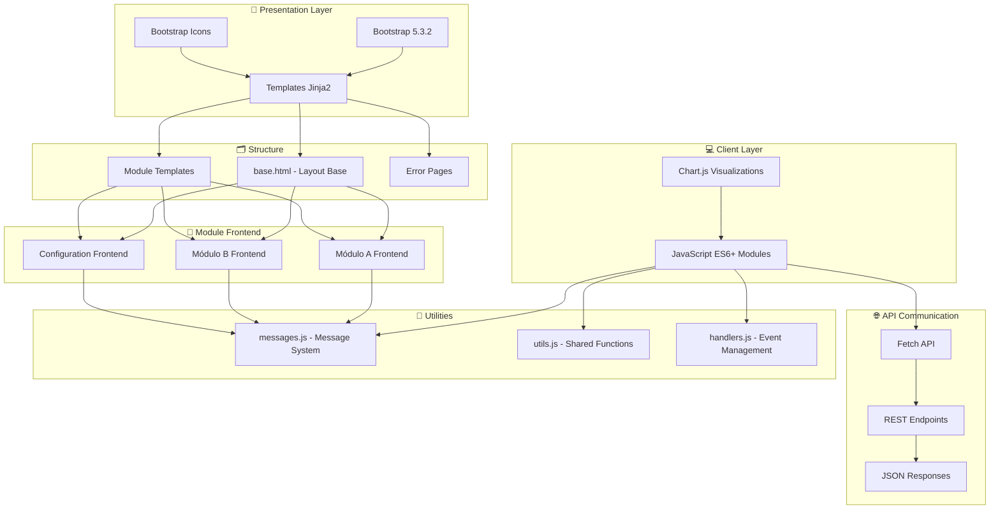

# Arquitectura Frontend y Mejores Prácticas

## 📋 Índice

1. [Visión General del Frontend](#visión-general-del-frontend)
2. [Arquitectura Frontend](#arquitectura-frontend)
3. [Stack Tecnológico Frontend](#stack-tecnológico-frontend)
4. [Estructura de Templates](#estructura-de-templates)
5. [Sistema de Estilos](#sistema-de-estilos)
6. [Arquitectura JavaScript](./frontend-javascript.md)
7. [Componentes y UX](./frontend-componentes.md)
8. [Calidad y Performance](./frontend-calidad.md)

---

## 1. Visión General del Frontend

Este frontend es una interfaz web moderna construida con una filosofía de **Bootstrap Puro**, que prioriza la simplicidad, consistencia y mantenibilidad sin sacrificar funcionalidad ni usabilidad.

### Características Principales

- **Bootstrap 5.3.2 Puro**: Sin customizaciones CSS adicionales
- **Arquitectura Modular**: Separación clara por módulos funcionales
- **JavaScript ES6+**: Módulos nativos y sintaxis moderna
- **Responsive Design**: Interfaz adaptable a todos los dispositivos
- **Componentes Reutilizables**: Elementos UI consistentes
- **Accesibilidad**: Diseño inclusivo con estándares web
- **Performance Optimizada**: Carga rápida y experiencia fluida

### Objetivos del Frontend

1. **Experiencia de Usuario**: Interfaz intuitiva y eficiente
2. **Consistencia Visual**: Diseño homogéneo en toda la aplicación
3. **Mantenibilidad**: Código frontend fácil de mantener y escalar
4. **Responsividad**: Funcionalidad completa en todos los dispositivos
5. **Accesibilidad**: Cumplimiento de estándares de accesibilidad web
6. **Performance**: Tiempos de carga optimizados

---

## 2. Arquitectura Frontend



### Principios Arquitectónicos Frontend

1. **Separación de Responsabilidades**: Templates, estilos y lógica separados
2. **Modularidad**: Cada módulo tiene su propio conjunto de archivos frontend
3. **Reutilización**: Componentes y utilidades compartidas
4. **Escalabilidad**: Estructura que permite crecimiento
5. **Mantenibilidad**: Código predecible y organizado
6. **Performance**: Optimización de recursos y carga

---

## 3. Stack Tecnológico Frontend

### Framework CSS Principal
```html
<!-- Bootstrap 5.3.2 - Framework CSS Principal -->
<link href="https://cdn.jsdelivr.net/npm/bootstrap@5.3.2/dist/css/bootstrap.min.css" 
      rel="stylesheet" 
      integrity="sha384-T3c6CoIi6uLrA9TneNEoa7RxnatzjcDSCmG1MXxSR1GAsXEV/Dwwykc2MPK8M2HN" 
      crossorigin="anonymous">
```

### Iconografía
```html
<!-- Bootstrap Icons 1.11.1 - Iconografía Moderna -->
<link rel="stylesheet" href="https://cdn.jsdelivr.net/npm/bootstrap-icons@1.11.1/font/bootstrap-icons.css">
```

### JavaScript Core
```html
<!-- Bootstrap JS 5.3.2 - Componentes Interactivos -->
<script src="https://cdn.jsdelivr.net/npm/bootstrap@5.3.2/dist/js/bootstrap.bundle.min.js" 
        integrity="sha384-C6RzsynM9kWDrMNeT87bh95OGNyZPhcTNXj1NW7RuBCsyN/o0jlpcV8Qyq46cDfL" 
        crossorigin="anonymous"></script>
```

### Visualización de Datos
- **Chart.js**: Gráficos interactivos para módulos de visualización de datos
- **Canvas API**: Renderizado de gráficos de alta performance

### Tecnologías Utilizadas

| Tecnología | Versión | Propósito | Justificación |
|-----------|---------|-----------|---------------|
| **Bootstrap** | 5.3.2 | Framework CSS principal | Consistencia, responsividad, mantenibilidad |
| **Bootstrap Icons** | 1.11.1 | Iconografía | Integración perfecta con Bootstrap |
| **Chart.js** | Latest | Visualización datos | Gráficos interactivos y responsivos |
| **Fetch API** | Nativo | Comunicación con APIs | Estándar moderno para peticiones HTTP |
| **ES6+ Modules** | Nativo | Modularidad JavaScript | Organización y reutilización de código |

---

## 4. Estructura de Templates

### Arquitectura de Templates

```
templates/
├── base.html                    # 🏗️ Template base con layout principal
├── index.html                   # 🏠 Página principal
├── module_a/                    # 💰 Templates módulo A
│   ├── index.html               # Dashboard del módulo
│   └── feature_1.html           # Página de funcionalidad 1
├── module_b/                    # 🎤 Templates módulo B
│   ├── index.html               # Dashboard del módulo
│   └── feature_1.html           # Página de funcionalidad 1
├── config.html                  # ⚙️ Configuración general
├── user_profile.html            # 👤 Perfil de usuario
└── errors/                      # ❌ Páginas de error
    ├── 404.html                 # Error 404
    └── 500.html                 # Error 500
```

### Template Base (`base.html`)

El `base.html` es el esqueleto de toda la aplicación. Incluye el layout principal, la navegación lateral, la barra superior y los recursos comunes (CSS y JS).

---

## 5. Sistema de Estilos

### Filosofía de Estilos: Bootstrap Puro

**Principio Fundamental**: Uso exclusivo de Bootstrap 5.3.2 sin customizaciones CSS que modifiquen el framework. Se permite la creación de clases de utilidad adicionales en archivos CSS por módulo, siempre que no sobreescriban los estilos de Bootstrap.

### Estructura de Archivos CSS

```
static/css/
├── module_a/                    # Estilos específicos del módulo A
│   └── dashboard.css            # Estilos del dashboard
└── module_b/                    # Estilos específicos del módulo B
    └── content.css              # Estilos de gestión de contenido
```

---

## Documentos Detallados

Para mantener la legibilidad y cumplir con la restricción de longitud de archivos, la documentación de frontend se ha dividido en varios documentos especializados.

- **[➡️ Arquitectura JavaScript](./frontend-javascript.md)**: Detalla los patrones de organización del código JS, la comunicación con APIs y la gestión de estado.
- **[➡️ Componentes y UX](./frontend-componentes.md)**: Describe los componentes de UI reutilizables y las estrategias de navegación y experiencia de usuario.
- **[➡️ Calidad y Performance](./frontend-calidad.md)**: Cubre temas avanzados como responsive design, performance, accesibilidad y testing. 