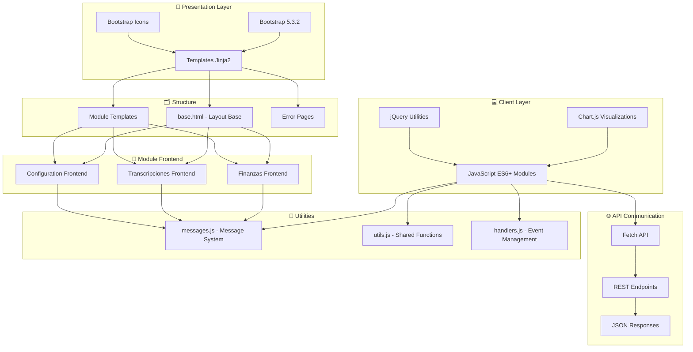
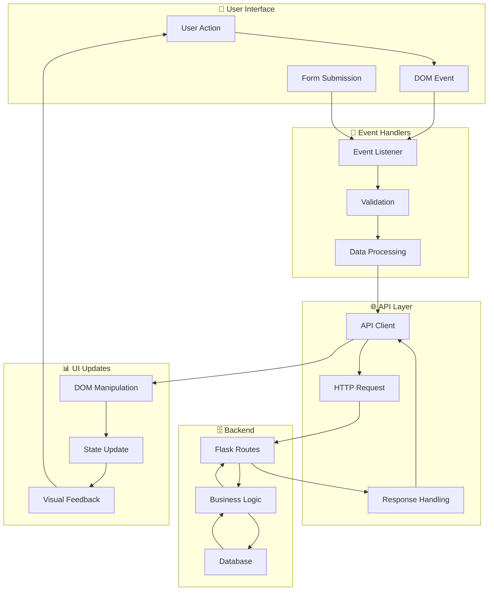

# Documento Frontend Completo - Proyecto Cerebro

## 📋 Índice

1. [Visión General del Frontend](#visión-general-del-frontend)
2. [Arquitectura Frontend](#arquitectura-frontend)
3. [Stack Tecnológico Frontend](#stack-tecnológico-frontend)
4. [Estructura de Templates](#estructura-de-templates)
5. [Sistema de Estilos](#sistema-de-estilos)
6. [Arquitectura JavaScript](#arquitectura-javascript)
7. [Componentes UI](#componentes-ui)
8. [Navegación y UX](#navegación-y-ux)
9. [Módulo Frontend de Finanzas](#módulo-frontend-de-finanzas)
10. [Módulo Frontend de Transcripciones](#módulo-frontend-de-transcripciones)
11. [Patrones de Diseño Frontend](#patrones-de-diseño-frontend)
12. [Flujo de Datos Frontend](#flujo-de-datos-frontend)
13. [Responsive Design](#responsive-design)
14. [Interactividad y Eventos](#interactividad-y-eventos)
15. [Validación y Formularios](#validación-y-formularios)
16. [Visualización de Datos](#visualización-de-datos)
17. [Performance Frontend](#performance-frontend)
18. [Accesibilidad](#accesibilidad)
19. [Testing Frontend](#testing-frontend)
20. [Mejores Prácticas](#mejores-prácticas)

---

## 1. Visión General del Frontend

**Cerebro Frontend** es una interfaz web moderna construida con una filosofía de **Bootstrap Puro**, que prioriza la simplicidad, consistencia y mantenibilidad sin sacrificar funcionalidad ni usabilidad.

### Características Principales

- **Bootstrap 5.3.2 Puro**: Sin customizaciones CSS adicionales
- **Arquitectura Modular**: Separación clara por módulos funcionales
- **JavaScript ES6+**: Módulos nativos y sintaxis moderna
- **Responsive Design**: Interfaz adaptable a todos los dispositivos
- **Componentes Reutilizables**: Elementos UI consistentes
- **Accesibilidad**: Diseño inclusivo con estándares web
- **Performance Optimizada**: Carga rápida y experiencia fluida

### Objetivos del Frontend

1. **Experiencia de Usuario**: Interfaz intuitiva y eficiente
2. **Consistencia Visual**: Diseño homogéneo en toda la aplicación
3. **Mantenibilidad**: Código frontend fácil de mantener y escalar
4. **Responsividad**: Funcionalidad completa en todos los dispositivos
5. **Accesibilidad**: Cumplimiento de estándares de accesibilidad web
6. **Performance**: Tiempos de carga optimizados

---

## 2. Arquitectura Frontend



### Principios Arquitectónicos Frontend

1. **Separación de Responsabilidades**: Templates, estilos y lógica separados
2. **Modularidad**: Cada módulo tiene su propio conjunto de archivos frontend
3. **Reutilización**: Componentes y utilidades compartidas
4. **Escalabilidad**: Estructura que permite crecimiento
5. **Mantenibilidad**: Código predecible y organizado
6. **Performance**: Optimización de recursos y carga

---

## 3. Stack Tecnológico Frontend

### Framework CSS Principal
```html
<!-- Bootstrap 5.3.2 - Framework CSS Principal -->
<link href="https://cdn.jsdelivr.net/npm/bootstrap@5.3.2/dist/css/bootstrap.min.css" 
      rel="stylesheet" 
      integrity="sha384-T3c6CoIi6uLrA9TneNEoa7RxnatzjcDSCmG1MXxSR1GAsXEV/Dwwykc2MPK8M2HN" 
      crossorigin="anonymous">
```

### Iconografía
```html
<!-- Bootstrap Icons 1.11.1 - Iconografía Moderna -->
<link rel="stylesheet" href="https://cdn.jsdelivr.net/npm/bootstrap-icons@1.11.1/font/bootstrap-icons.css">
```

### JavaScript Core
```html
<!-- jQuery 3.7.1 - Utilidades DOM -->
<script src="https://code.jquery.com/jquery-3.7.1.min.js" 
        integrity="sha256-/JqT3SQfawRcv/BIHPThkBvs0OEvtFFmqPF/lYI/Cxo=" 
        crossorigin="anonymous"></script>

<!-- Bootstrap JS 5.3.2 - Componentes Interactivos -->
<script src="https://cdn.jsdelivr.net/npm/bootstrap@5.3.2/dist/js/bootstrap.bundle.min.js" 
        integrity="sha384-C6RzsynM9kWDrMNeT87bh95OGNyZPhcTNXj1NW7RuBCsyN/o0jlpcV8Qyq46cDfL" 
        crossorigin="anonymous"></script>
```

### Visualización de Datos
- **Chart.js**: Gráficos interactivos para módulo de finanzas
- **Canvas API**: Renderizado de gráficos de alta performance

### Tecnologías Utilizadas

| Tecnología | Versión | Propósito | Justificación |
|-----------|---------|-----------|---------------|
| **Bootstrap** | 5.3.2 | Framework CSS principal | Consistencia, responsividad, mantenibilidad |
| **Bootstrap Icons** | 1.11.1 | Iconografía | Integración perfecta con Bootstrap |
| **jQuery** | 3.7.1 | Utilidades DOM | Simplificación de manipulación DOM |
| **Chart.js** | Latest | Visualización datos | Gráficos interactivos y responsivos |
| **Fetch API** | Nativo | Comunicación con APIs | Estándar moderno para peticiones HTTP |
| **ES6+ Modules** | Nativo | Modularidad JavaScript | Organización y reutilización de código |

---

## 4. Estructura de Templates

### Arquitectura de Templates

```
templates/
├── base.html                    # 🏗️ Template base con layout principal
├── index.html                   # 🏠 Página principal
├── finanzas/                    # 💰 Templates módulo financiero
│   ├── index.html               # Dashboard financiero
│   ├── saldos.html              # Gestión de saldos
│   ├── saldos_detalle.html      # Detalle de saldos por fecha
│   ├── indicadores.html         # Indicadores económicos
│   ├── metas.html               # Metas financieras
│   └── graficos.html            # Visualización de gráficos
├── transcripciones/             # 🎤 Templates módulo transcripciones
│   ├── index.html               # Dashboard transcripciones
│   ├── archivos.html            # Gestión de archivos
│   ├── consulta_detalle.html    # Detalle de consultas IA
│   ├── consultas.html           # Consultas IA
│   ├── prompts.html             # Gestión de prompts
│   └── tags.html                # Gestión de etiquetas
├── config.html                  # ⚙️ Configuración general
├── openrouter.html              # 🤖 Configuración OpenRouter
├── backblaze.html               # 🗄️ Configuración Backblaze B2
├── user_profile.html            # 👤 Perfil de usuario
└── errors/                      # ❌ Páginas de error
    ├── 404.html                 # Error 404
    └── 500.html                 # Error 500
```

### Template Base (`base.html`)

#### Características del Template Base

1. **HTML5 Semántico**: Estructura completa con metadatos
2. **Responsive Meta Tags**: Configuración para dispositivos móviles
3. **CDN Optimization**: Recursos externos optimizados
4. **Navigation System**: Sidebar y top navigation
5. **Flash Messages**: Sistema de mensajes integrado
6. **System Info Panel**: Información del sistema en tiempo real

#### Estructura del Layout

```html
<!DOCTYPE html>
<html lang="en">
<head>
    <!-- Meta tags, CDN resources, favicon -->
</head>
<body>
    <div class="d-flex">
        <!-- Sidebar Navigation -->
        <div class="bg-light border-end flex-shrink-0 d-flex flex-column" style="width: 250px;">
            <!-- Brand, Navigation Menu, System Info -->
        </div>
        
        <!-- Main Content Area -->
        <div class="flex-fill">
            <!-- Top Navigation -->
            <nav class="navbar navbar-expand-lg navbar-light bg-light border-bottom">
                <!-- User dropdown, notifications -->
            </nav>
            
            <!-- Page Content -->
            <div class="container-fluid p-4">
                
            </div>
        </div>
    </div>
</body>
</html>
```

#### Navegación Lateral

**Estructura de Navegación:**
- **Dashboard General**: Página principal del sistema
- **Usuarios**: Gestión de perfiles de usuario
- **Transcripciones**: Acceso al módulo de transcripciones
- **Finanzas**: Dropdown con submódulos financieros
  - Dashboard Finanzas
  - Gráficos y Análisis
  - Gestión de Saldos
  - Indicadores Económicos
  - Metas Financieras
- **API**: Documentación de APIs disponibles
- **OpenRouter**: Configuración de modelos IA
- **Backblaze B2**: Configuración de almacenamiento
- **Configuración**: Configuración general del sistema

#### Panel de Información del Sistema

**Información Mostrada:**
- **IP Address**: Dirección IP del servidor
- **Server Port**: Puerto de escucha
- **Environment**: Entorno de ejecución
- **Memory Usage**: Uso de memoria en tiempo real
- **CPU Usage**: Información de procesamiento
- **Uptime**: Tiempo de actividad del servidor

---

## 5. Sistema de Estilos

### Filosofía de Estilos: Bootstrap Puro

**Principio Fundamental**: Uso exclusivo de Bootstrap 5.3.2 sin customizaciones CSS adicionales.

#### Beneficios del Enfoque Bootstrap Puro

1. **Consistencia Total**: Diseño homogéneo en toda la aplicación
2. **Mantenibilidad**: Sin CSS personalizado que mantener
3. **Performance**: Carga optimizada sin CSS redundante
4. **Escalabilidad**: Fácil agregar nuevas funcionalidades
5. **Estándares**: Cumple con mejores prácticas de diseño web
6. **Responsive**: Diseño adaptable por defecto

### Estructura de Archivos CSS

```
static/css/
├── finanzas/                    # Estilos específicos de finanzas
│   ├── dashboard.css            # Dashboard financiero
│   ├── saldos.css               # Gestión de saldos
│   ├── indicadores.css          # Indicadores económicos
│   ├── metas.css                # Metas financieras
│   └── graficos.css             # Visualización de gráficos
└── transcripciones/             # Estilos específicos de transcripciones
    ├── archivos.css             # Gestión de archivos
    ├── consultas.css            # Consultas IA
    └── consulta_detalle.css     # Detalle de consultas
```

### Clases CSS Específicas por Módulo

#### Módulo de Finanzas

##### Dashboard Financiero (`dashboard.css`)
```css
/* Estados de variación */
.var-positiva {
    color: #28a745;
    font-weight: 600;
}

.var-negativa {
    color: #dc3545;
    font-weight: 600;
}

.var-neutral {
    color: #6c757d;
    font-weight: 500;
}

/* Badges de variación */
.badge-var-positiva {
    background-color: #d4edda;
    color: #155724;
}

/* Formato de números */
.saldo-total {
    font-weight: 600;
    font-family: 'Courier New', monospace;
}
```

##### Gestión de Saldos (`saldos.css`)
```css
/* Badges de moneda */
.badge-CLP {
    background-color: #198754;
    color: white;
}

.badge-USD {
    background-color: #0d6efd;
    color: white;
}

.badge-EUR {
    background-color: #6610f2;
    color: white;
}

/* Formateo de saldos */
.saldo-positivo {
    color: #198754;
    font-weight: 600;
}

.saldo-negativo {
    color: #dc3545;
    font-weight: 600;
}
```

##### Gráficos (`graficos.css`)
```css
/* Contenedores de gráficos */
.chart-container {
    position: relative;
    height: 400px;
    width: 100%;
    margin: 0 auto;
}

/* Variables CSS para Chart.js */
:root {
    --chart-primary: #0d6efd;
    --chart-success: #198754;
    --chart-info: #0dcaf0;
    --trend-line-daily: rgba(13, 110, 253, 0.8);
    --trend-line-quarterly: rgba(25, 135, 84, 0.8);
}
```

#### Módulo de Transcripciones

##### Gestión de Archivos (`archivos.css`)
```css
/* Nombres de archivos */
.file-name-display {
    white-space: normal;
    word-wrap: break-word;
}

/* Resultados de búsqueda */
.search-highlight {
    background-color: #fff3cd;
    padding: 0.1rem 0.2rem;
    border-radius: 0.2rem;
}

/* Modal de renombrado IA */
.modal-dialog.ai-rename-modal {
    max-width: 800px;
}
```

### Componentes UI Reutilizables

#### Estados de Carga
```css
.loading-overlay {
    position: relative;
}

.loading-skeleton {
    background: linear-gradient(90deg, #f0f0f0 25%, #e0e0e0 50%, #f0f0f0 75%);
    background-size: 200% 100%;
    animation: loading 1.5s infinite;
}

@keyframes loading {
    0% { background-position: 200% 0; }
    100% { background-position: -200% 0; }
}
```

#### Animaciones
```css
@keyframes fadeIn {
    from { opacity: 0; transform: translateY(10px); }
    to { opacity: 1; transform: translateY(0); }
}

.fade-in {
    animation: fadeIn 0.3s ease-out;
}

@keyframes pulse {
    0%, 100% { opacity: 0.5; }
    50% { opacity: 0.8; }
}
```

---

## 6. Arquitectura JavaScript

### Estructura de Archivos JavaScript

```
static/js/
├── messages.js                  # 🔧 Sistema de mensajes estandarizados
├── finanzas/                    # 💰 JavaScript módulo financiero
│   ├── utils.js                 # Utilidades compartidas
│   ├── dashboard/
│   │   └── main.js              # Dashboard financiero
│   ├── saldos/
│   │   └── main.js              # Gestión de saldos
│   ├── indicadores/
│   │   ├── main.js              # Lógica principal
│   │   ├── handlers.js          # Manejadores de eventos
│   │   └── ui.js                # Manipulación UI
│   ├── metas/
│   │   └── main.js              # Gestión de metas
│   └── graficos/
│       └── main.js              # Visualización de gráficos
└── transcripciones/             # 🎤 JavaScript módulo transcripciones
    ├── archivos/
    │   ├── main.js              # Punto de entrada
    │   ├── handlers.js          # Lógica de negocio
    │   └── ui.js                # Manipulación UI
    ├── consultas/
    │   ├── main.js              # Gestión de consultas
    │   ├── handlers.js          # Manejadores de eventos
    │   └── ui.js                # Interfaz de usuario
    └── consulta_detalle/
        └── main.js              # Detalle de consultas
```

### Patrones de Organización JavaScript

#### Patrón Modular ES6+

**Características:**
- **Imports/Exports**: Uso de módulos nativos ES6
- **Separación de Responsabilidades**: Archivos especializados por función
- **Reutilización**: Funciones exportables entre módulos
- **Mantenibilidad**: Código organizado y predecible

#### Estructura de Módulos

##### Módulo Principal (`main.js`)
```javascript
// Ejemplo: transcripciones/archivos/main.js
import {
    loadFiles,
    importFiles,
    handleSearch,
    clearSearch
} from './handlers.js';

import { cleanupModalState } from './ui.js';

document.addEventListener('DOMContentLoaded', function() {
    console.log('Archivos page loaded');
    
    // Cleanup inicial
    cleanupModalState();
    
    // Bind eventos principales
    document.getElementById('refreshBtn').addEventListener('click', loadFiles);
    document.getElementById('importBtn').addEventListener('click', importFiles);
    
    // Carga inicial
    loadFiles();
});
```

##### Manejadores de Eventos (`handlers.js`)
```javascript
// Ejemplo: transcripciones/archivos/handlers.js
import { showToast, showLoadingState, displayFiles } from './ui.js';

let filesData = [];
let filteredFilesData = [];

// API Calls
async function fetchFromServer(url, options = {}) {
    try {
        const response = await fetch(url, options);
        if (!response.ok) {
            throw new Error(`Error ${response.status}`);
        }
        return await response.json();
    } catch (error) {
        showToast('error', `Error de conexión: ${error.message}`);
        return { success: false, message: error.message };
    }
}

// Exportar funciones
export {
    loadFiles,
    importFiles,
    handleSearch,
    clearSearch
};
```

##### Manipulación UI (`ui.js`)
```javascript
// Ejemplo: transcripciones/archivos/ui.js
export function showToast(type, message) {
    // Implementación de toast notifications
}

export function showLoadingState() {
    // Mostrar estado de carga
}

export function displayFiles(files) {
    // Renderizar tabla de archivos
}
```

### Utilidades Compartidas

#### Sistema de Mensajes (`messages.js`)
```javascript
const Messages = {
    SUCCESS: {
        TAG_CREATED: 'Tag agregado exitosamente',
        FILES_IMPORTED: 'Archivos importados exitosamente',
        CONFIGURATION_SAVED: 'Configuración guardada exitosamente'
    },
    ERROR: {
        CONNECTION_FAILED: 'Error de conexión con el servidor',
        INVALID_DATA: 'Datos inválidos proporcionados',
        UNAUTHORIZED: 'No autorizado para esta acción'
    }
};

class MessageFormatter {
    static success(message, data = null) {
        return {
            success: true,
            message: message,
            data: data
        };
    }
    
    static error(message, data = null) {
        return {
            success: false,
            message: message,
            data: data
        };
    }
}
```

#### Utilidades Finanzas (`finanzas/utils.js`)
```javascript
class FinanzasUtils {
    static PORTFOLIO_STORAGE_KEY = 'finanzas_selected_portfolio';
    
    static getSelectedPortfolio() {
        return localStorage.getItem(this.PORTFOLIO_STORAGE_KEY);
    }
    
    static setSelectedPortfolio(portfolio) {
        localStorage.setItem(this.PORTFOLIO_STORAGE_KEY, portfolio);
    }
    
    static formatCurrency(amount, currency = 'CLP') {
        return new Intl.NumberFormat('es-CL', {
            style: 'currency',
            currency: currency
        }).format(amount);
    }
    
    static async loadPortfolios() {
        try {
            const response = await fetch('/api/finanzas/dashboard/usuarios');
            const data = await response.json();
            
            if (data.success) {
                return data.data;
            }
            throw new Error(data.message);
        } catch (error) {
            console.error('Error cargando portafolios:', error);
            return [];
        }
    }
}

// Exportar para uso global
window.FinanzasUtils = FinanzasUtils;
```

### Patrones de Comunicación con APIs

#### Patrón Fetch Estandarizado
```javascript
class ApiClient {
    static async request(url, options = {}) {
        const defaultOptions = {
            method: 'GET',
            headers: {
                'Content-Type': 'application/json',
                'X-Requested-With': 'XMLHttpRequest'
            }
        };
        
        const finalOptions = { ...defaultOptions, ...options };
        
        try {
            const response = await fetch(url, finalOptions);
            
            if (!response.ok) {
                const errorData = await response.json().catch(() => ({ 
                    message: response.statusText 
                }));
                throw new Error(errorData.message || `Error ${response.status}`);
            }
            
            return await response.json();
        } catch (error) {
            console.error('API Error:', error);
            throw error;
        }
    }
    
    static async get(url) {
        return this.request(url, { method: 'GET' });
    }
    
    static async post(url, data) {
        return this.request(url, {
            method: 'POST',
            body: JSON.stringify(data)
        });
    }
    
    static async put(url, data) {
        return this.request(url, {
            method: 'PUT',
            body: JSON.stringify(data)
        });
    }
    
    static async delete(url) {
        return this.request(url, { method: 'DELETE' });
    }
}
```

### Gestión de Estados

#### State Management Pattern
```javascript
class StateManager {
    constructor() {
        this.state = {};
        this.listeners = {};
    }
    
    setState(key, value) {
        this.state[key] = value;
        this.notifyListeners(key, value);
    }
    
    getState(key) {
        return this.state[key];
    }
    
    subscribe(key, callback) {
        if (!this.listeners[key]) {
            this.listeners[key] = [];
        }
        this.listeners[key].push(callback);
    }
    
    notifyListeners(key, value) {
        if (this.listeners[key]) {
            this.listeners[key].forEach(callback => callback(value));
        }
    }
}
```

---

## 7. Componentes UI

### Componentes Bootstrap Utilizados

#### Navegación
- **Navbar**: Barra de navegación superior con dropdown de usuario
- **Nav**: Navegación lateral con submenu desplegable
- **Breadcrumb**: Navegación contextual en páginas profundas

#### Contenedores
- **Container**: Contenedores responsivos para el contenido
- **Card**: Tarjetas para agrupar información relacionada
- **Accordion**: Secciones desplegables para información extensa

#### Formularios
- **Form**: Formularios con validación Bootstrap
- **Input Group**: Grupos de entrada con iconos y botones
- **Select**: Dropdowns personalizados
- **Datalist**: Autocompletado para entradas

#### Tablas
- **Table**: Tablas responsivas con ordenamiento
- **Pagination**: Paginación para grandes conjuntos de datos
- **Badge**: Indicadores de estado y categorías

#### Modales y Alertas
- **Modal**: Diálogos para confirmaciones y formularios
- **Alert**: Mensajes de feedback y notificaciones
- **Toast**: Notificaciones temporales no intrusivas

#### Botones y Controles
- **Button**: Botones con diferentes estilos y estados
- **Button Group**: Agrupación de botones relacionados
- **Dropdown**: Menús desplegables

### Componentes Personalizados

#### Sistema de Mensajes
```javascript
// Implementación de toast notifications
function showToast(type, message, duration = 5000) {
    const toastContainer = document.getElementById('toastContainer') || createToastContainer();
    
    const toast = document.createElement('div');
    toast.className = `toast align-items-center text-white bg-${type} border-0`;
    toast.setAttribute('role', 'alert');
    toast.innerHTML = `
        <div class="d-flex">
            <div class="toast-body">
                <i class="bi bi-${getIconForType(type)} me-2"></i>
                ${message}
            </div>
            <button type="button" class="btn-close btn-close-white me-2 m-auto" 
                    data-bs-dismiss="toast"></button>
        </div>
    `;
    
    toastContainer.appendChild(toast);
    
    const bsToast = new bootstrap.Toast(toast, { delay: duration });
    bsToast.show();
}
```

#### Estados de Carga
```javascript
// Loading states para diferentes componentes
function showLoadingState(containerId) {
    const container = document.getElementById(containerId);
    container.innerHTML = `
        <div class="d-flex justify-content-center align-items-center" style="min-height: 200px;">
            <div class="spinner-border text-primary" role="status">
                <span class="visually-hidden">Cargando...</span>
            </div>
        </div>
    `;
}

// Skeleton loading para tablas
function showSkeletonTable(containerId, rows = 5) {
    const container = document.getElementById(containerId);
    const skeleton = Array(rows).fill().map(() => `
        <tr>
            <td><div class="loading-skeleton" style="height: 20px;"></div></td>
            <td><div class="loading-skeleton" style="height: 20px;"></div></td>
            <td><div class="loading-skeleton" style="height: 20px;"></div></td>
        </tr>
    `).join('');
    
    container.innerHTML = `
        <table class="table">
            <tbody>${skeleton}</tbody>
        </table>
    `;
}
```

#### Selector de Portafolio
```javascript
// Componente reutilizable para selección de portafolio
class PortfolioSelector {
    constructor(containerId, onChangeCallback) {
        this.container = document.getElementById(containerId);
        this.onChangeCallback = onChangeCallback;
        this.init();
    }
    
    async init() {
        this.render();
        await this.loadPortfolios();
        this.bindEvents();
    }
    
    render() {
        this.container.innerHTML = `
            <div class="mb-3">
                <label class="form-label fw-bold">
                    <i class="bi bi-person-workspace me-2"></i>
                    Portafolio:
                </label>
                <select class="form-select" id="portfolioSelect">
                    <option value="">Seleccionar portafolio...</option>
                </select>
            </div>
        `;
    }
    
    async loadPortfolios() {
        try {
            const portfolios = await FinanzasUtils.loadPortfolios();
            const select = document.getElementById('portfolioSelect');
            
            portfolios.forEach(portfolio => {
                const option = document.createElement('option');
                option.value = portfolio.usuario;
                option.textContent = portfolio.usuario;
                select.appendChild(option);
            });
            
            // Restaurar selección previa
            const savedPortfolio = FinanzasUtils.getSelectedPortfolio();
            if (savedPortfolio) {
                select.value = savedPortfolio;
            }
        } catch (error) {
            console.error('Error loading portfolios:', error);
        }
    }
    
    bindEvents() {
        document.getElementById('portfolioSelect').addEventListener('change', (e) => {
            const selectedPortfolio = e.target.value;
            FinanzasUtils.setSelectedPortfolio(selectedPortfolio);
            
            if (this.onChangeCallback) {
                this.onChangeCallback(selectedPortfolio);
            }
        });
    }
}
```

---

## 8. Navegación y UX

### Estructura de Navegación

#### Navegación Principal
```html
<!-- Sidebar Navigation -->
<div class="bg-light border-end flex-shrink-0 d-flex flex-column" style="width: 250px;">
    <div class="p-3 border-bottom">
        <i class="bi bi-brain me-2"></i>
        <strong>Cerebro</strong>
    </div>
    <div class="list-group list-group-flush flex-grow-1">
        <!-- Navigation Items -->
        <a class="list-group-item list-group-item-action" href="/">
            <i class="bi bi-house-door me-2"></i>
            Dashboard
        </a>
        
        <!-- Finanzas Dropdown -->
        <div class="list-group-item list-group-item-action dropdown-toggle" 
             data-bs-toggle="collapse" data-bs-target="#finanzasSubmenu">
            <i class="bi bi-graph-up me-2"></i>
            Finanzas
        </div>
        <div class="collapse" id="finanzasSubmenu">
            <div class="list-group list-group-flush">
                <a class="list-group-item list-group-item-action ps-4" href="/finanzas/">
                    <i class="bi bi-speedometer2 me-2"></i>
                    Dashboard
                </a>
                <a class="list-group-item list-group-item-action ps-4" href="/finanzas/graficos">
                    <i class="bi bi-graph-up me-2"></i>
                    Gráficos
                </a>
                <!-- Más elementos del submenu -->
            </div>
        </div>
    </div>
</div>
```

#### Navegación Contextual
```html
<!-- Tab Navigation en módulos -->
<ul class="nav nav-tabs card-header-tabs">
    <li class="nav-item">
        <a class="nav-link active" href="/transcripciones/archivos">
            <i class="bi bi-folder me-1"></i>
            Archivos
        </a>
    </li>
    <li class="nav-item">
        <a class="nav-link" href="/transcripciones/tags">
            <i class="bi bi-tags me-1"></i>
            Tags
        </a>
    </li>
    <li class="nav-item">
        <a class="nav-link" href="/transcripciones/prompts">
            <i class="bi bi-chat-dots me-1"></i>
            Prompts
        </a>
    </li>
</ul>
```

### Gestión de Estado de Navegación

#### Activación de Elementos de Navegación
```javascript
// Navigation State Management
$(document).ready(function() {
    const currentPath = window.location.pathname;
    
    // Activar elemento de navegación principal
    $('.list-group-item').each(function() {
        const linkPath = $(this).attr('href');
        if (linkPath && currentPath.startsWith(linkPath) && linkPath !== '/') {
            $(this).addClass('active');
        }
    });
    
    // Mantener submenu abierto para páginas de finanzas
    if (currentPath.startsWith('/finanzas')) {
        $('#finanzasSubmenu').addClass('show');
        $('[data-bs-target="#finanzasSubmenu"]').addClass('active');
        
        // Activar elemento específico del submenu
        $('#finanzasSubmenu a').each(function() {
            const linkPath = $(this).attr('href');
            if (linkPath && currentPath === linkPath) {
                $(this).addClass('active');
            }
        });
    }
});
```

### Experiencia de Usuario (UX)

#### Principios de Diseño UX

1. **Consistencia**: Elementos similares comportándose de manera similar
2. **Feedback**: Respuesta inmediata a las acciones del usuario
3. **Eficiencia**: Minimizar el número de clics para tareas comunes
4. **Claridad**: Información presentada de manera clara y comprensible
5. **Accesibilidad**: Interfaz usable por personas con diferentes capacidades

#### Patrones de Interacción

##### Carga Asíncrona
```javascript
// Patrón de carga asíncrona con feedback visual
async function loadDataWithFeedback(loadFunction, containerId) {
    // Mostrar estado de carga
    showLoadingState(containerId);
    
    try {
        const data = await loadFunction();
        
        if (data.success) {
            // Mostrar datos
            displayData(data.data, containerId);
            showToast('success', 'Datos cargados exitosamente');
        } else {
            throw new Error(data.message);
        }
    } catch (error) {
        // Mostrar estado de error
        showErrorState(containerId, error.message);
        showToast('error', `Error al cargar datos: ${error.message}`);
    }
}
```

##### Confirmación de Acciones Destructivas
```javascript
// Patrón de confirmación para acciones destructivas
function confirmDelete(itemName, deleteFunction) {
    const modal = new bootstrap.Modal(document.getElementById('confirmDeleteModal'));
    
    document.getElementById('deleteItemName').textContent = itemName;
    
    document.getElementById('confirmDeleteBtn').onclick = async () => {
        try {
            await deleteFunction();
            modal.hide();
            showToast('success', 'Elemento eliminado exitosamente');
        } catch (error) {
            showToast('error', `Error al eliminar: ${error.message}`);
        }
    };
    
    modal.show();
}
```

##### Búsqueda en Tiempo Real
```javascript
// Búsqueda en tiempo real con debouncing
function setupRealTimeSearch(inputId, searchFunction, delay = 300) {
    let searchTimeout;
    
    document.getElementById(inputId).addEventListener('input', (e) => {
        clearTimeout(searchTimeout);
        
        searchTimeout = setTimeout(() => {
            const query = e.target.value.trim();
            
            if (query.length > 0) {
                searchFunction(query);
            } else {
                clearSearchResults();
            }
        }, delay);
    });
}
```

---

## 9. Módulo Frontend de Finanzas

### Arquitectura del Módulo

#### Estructura de Archivos
```
static/js/finanzas/
├── utils.js                     # Utilidades compartidas
├── dashboard/
│   └── main.js                  # Dashboard principal
├── saldos/
│   └── main.js                  # Gestión de saldos
├── indicadores/
│   ├── main.js                  # Lógica principal
│   ├── handlers.js              # Manejadores de eventos
│   └── ui.js                    # Manipulación UI
├── metas/
│   └── main.js                  # Gestión de metas
└── graficos/
    └── main.js                  # Visualización de gráficos
```

### Dashboard Financiero

#### Funcionalidades Principales

1. **Selector de Portafolio**: Permite cambiar entre diferentes portafolios
2. **Tabla de Saldos**: Muestra saldos consolidados por fecha
3. **Análisis de Variaciones**: Cálculo de variaciones diarias y YTD
4. **Navegación a Detalle**: Enlace a vista detallada por fecha
5. **Eliminación de Fechas**: Funcionalidad para eliminar fechas completas

#### Implementación JavaScript

```javascript
class DashboardManager {
    constructor() {
        this.currentPortfolio = null;
        this.saldosData = [];
        this.modalEliminar = null;
        this.fechaEliminar = null;
        
        this.init();
    }
    
    async init() {
        // Inicializar elementos DOM
        this.initializeElements();
        
        // Cargar portafolios disponibles
        await this.loadPortfolios();
        
        // Bind eventos
        this.bindEvents();
        
        // Cargar datos iniciales
        await this.loadDashboardData();
    }
    
    async loadPortfolios() {
        try {
            const response = await fetch('/api/finanzas/dashboard/usuarios');
            const data = await response.json();
            
            if (data.success) {
                this.populatePortfolioSelector(data.data);
            }
        } catch (error) {
            console.error('Error loading portfolios:', error);
        }
    }
    
    async loadDashboardData() {
        if (!this.currentPortfolio) return;
        
        try {
            showLoadingState('tablaSaldos');
            
            const response = await fetch(`/api/finanzas/dashboard/saldos-totales?usuario=${this.currentPortfolio}`);
            const data = await response.json();
            
            if (data.success) {
                this.saldosData = data.data;
                this.renderSaldosTable();
            }
        } catch (error) {
            console.error('Error loading dashboard data:', error);
        }
    }
    
    renderSaldosTable() {
        const tbody = document.querySelector('#tablaSaldos tbody');
        
        if (this.saldosData.length === 0) {
            tbody.innerHTML = `
                <tr>
                    <td colspan="6" class="text-center text-muted">
                        No hay datos disponibles para el portafolio seleccionado
                    </td>
                </tr>
            `;
            return;
        }
        
        tbody.innerHTML = this.saldosData.map(saldo => `
            <tr>
                <td>${saldo.fecha}</td>
                <td class="text-end saldo-total">${this.formatCurrency(saldo.total)}</td>
                <td class="text-end ${this.getVariationClass(saldo.variacion_diaria)}">
                    ${this.formatVariation(saldo.variacion_diaria)}
                </td>
                <td class="text-end ${this.getVariationClass(saldo.variacion_ytd)}">
                    ${this.formatVariation(saldo.variacion_ytd)}
                </td>
                <td class="text-end">
                    <span class="badge bg-info">${saldo.dias_proyeccion || 'N/A'}</span>
                </td>
                <td class="text-end">
                    <div class="btn-group" role="group">
                        <a href="/finanzas/saldos/${saldo.fecha}" class="btn btn-sm btn-outline-primary">
                            <i class="bi bi-eye"></i>
                        </a>
                        <button class="btn btn-sm btn-outline-danger" 
                                onclick="dashboard.eliminarFecha('${saldo.fecha}')">
                            <i class="bi bi-trash"></i>
                        </button>
                    </div>
                </td>
            </tr>
        `).join('');
    }
}
```

### Gestión de Saldos

#### Funcionalidades CRUD

1. **Crear Saldo**: Formulario modal para agregar nuevos saldos
2. **Editar Saldo**: Edición inline o modal para modificar saldos
3. **Eliminar Saldo**: Confirmación antes de eliminar
4. **Filtros**: Filtrado por entidad, moneda, fecha
5. **Validación**: Validación de datos en tiempo real

#### Implementación del Formulario

```javascript
class SaldosManager {
    constructor() {
        this.currentUser = null;
        this.saldos = [];
        this.entidades = [];
        this.cuentas = [];
        this.monedas = [];
        this.editingId = null;
        this.filtros = {
            entidad: '',
            moneda: '',
            fecha_desde: '',
            fecha_hasta: '',
            limit: 100
        };
        
        this.init();
    }
    
    async saveSaldo(formData) {
        try {
            const url = this.editingId 
                ? `/api/finanzas/saldos/${this.editingId}`
                : '/api/finanzas/saldos/';
            
            const method = this.editingId ? 'PUT' : 'POST';
            
            const response = await fetch(url, {
                method: method,
                headers: {
                    'Content-Type': 'application/json',
                },
                body: JSON.stringify(formData)
            });
            
            const data = await response.json();
            
            if (data.success) {
                this.closeModal();
                await this.loadSaldos();
                showToast('success', data.message);
            } else {
                throw new Error(data.message);
            }
        } catch (error) {
            showToast('error', `Error al guardar saldo: ${error.message}`);
        }
    }
    
    validateForm(formData) {
        const errors = {};
        
        if (!formData.usuario) {
            errors.usuario = 'El usuario es requerido';
        }
        
        if (!formData.entidad) {
            errors.entidad = 'La entidad es requerida';
        }
        
        if (!formData.cuenta) {
            errors.cuenta = 'La cuenta es requerida';
        }
        
        if (!formData.moneda) {
            errors.moneda = 'La moneda es requerida';
        }
        
        if (!formData.saldo || isNaN(formData.saldo)) {
            errors.saldo = 'El saldo debe ser un número válido';
        }
        
        if (!formData.fecha || !this.isValidDate(formData.fecha)) {
            errors.fecha = 'La fecha debe ser válida';
        }
        
        return errors;
    }
}
```

### Visualización de Gráficos

#### Gráficos Implementados

1. **Evolución Diaria**: Gráfico de línea con evolución temporal
2. **Análisis Trimestral**: Agrupación por trimestres
3. **Días a Meta**: Proyección hacia objetivos financieros
4. **Tendencias**: Regresión lineal para análisis de tendencias

#### Implementación con Chart.js

```javascript
class GraficosManager {
    constructor() {
        this.currentPortfolio = null;
        this.dailyChart = null;
        this.quarterlyChart = null;
        this.daysToGoalChart = null;
        
        this.init();
    }
    
    async createDailyChart(data) {
        const ctx = document.getElementById('dailyChart').getContext('2d');
        
        // Destruir gráfico anterior si existe
        if (this.dailyChart) {
            this.dailyChart.destroy();
        }
        
        // Procesar datos
        const labels = data.map(item => item.fecha);
        const totals = data.map(item => item.total);
        
        // Calcular línea de tendencia
        const trendLine = this.calculateTrendLine(totals);
        
        this.dailyChart = new Chart(ctx, {
            type: 'line',
            data: {
                labels: labels,
                datasets: [{
                    label: 'Saldo Total (CLP)',
                    data: totals,
                    borderColor: 'var(--chart-primary)',
                    backgroundColor: 'rgba(13, 110, 253, 0.1)',
                    tension: 0.1,
                    fill: true
                }, {
                    label: 'Tendencia',
                    data: trendLine,
                    borderColor: 'var(--trend-line-daily)',
                    backgroundColor: 'transparent',
                    borderDash: [5, 5],
                    pointRadius: 0,
                    pointHoverRadius: 0
                }]
            },
            options: {
                responsive: true,
                maintainAspectRatio: false,
                plugins: {
                    title: {
                        display: true,
                        text: 'Evolución Diaria del Patrimonio'
                    },
                    legend: {
                        position: 'top'
                    }
                },
                scales: {
                    x: {
                        display: true,
                        title: {
                            display: true,
                            text: 'Fecha'
                        }
                    },
                    y: {
                        display: true,
                        title: {
                            display: true,
                            text: 'Saldo (CLP)'
                        },
                        ticks: {
                            callback: function(value) {
                                return new Intl.NumberFormat('es-CL', {
                                    style: 'currency',
                                    currency: 'CLP'
                                }).format(value);
                            }
                        }
                    }
                }
            }
        });
    }
    
    calculateTrendLine(data) {
        const n = data.length;
        const sumX = data.reduce((sum, _, i) => sum + i, 0);
        const sumY = data.reduce((sum, y) => sum + y, 0);
        const sumXY = data.reduce((sum, y, i) => sum + (i * y), 0);
        const sumXX = data.reduce((sum, _, i) => sum + (i * i), 0);
        
        const slope = (n * sumXY - sumX * sumY) / (n * sumXX - sumX * sumX);
        const intercept = (sumY - slope * sumX) / n;
        
        return data.map((_, i) => slope * i + intercept);
    }
}
```

---

## 10. Módulo Frontend de Transcripciones

### Arquitectura del Módulo

#### Estructura de Archivos
```
static/js/transcripciones/
├── archivos/
│   ├── main.js                  # Punto de entrada
│   ├── handlers.js              # Lógica de negocio
│   └── ui.js                    # Manipulación UI
├── consultas/
│   ├── main.js                  # Gestión de consultas
│   ├── handlers.js              # Manejadores de eventos
│   └── ui.js                    # Interfaz de usuario
└── consulta_detalle/
    └── main.js                  # Detalle de consultas
```

### Gestión de Archivos

#### Funcionalidades Principales

1. **Importación desde B2**: Sincronización con Backblaze B2
2. **Gestión de Metadatos**: Información detallada de archivos
3. **Sistema de Etiquetas**: Categorización flexible
4. **Búsqueda Avanzada**: Filtros múltiples y búsqueda de texto
5. **Visualización de Contenido**: Preview de transcripciones
6. **Operaciones Masivas**: Selección múltiple para acciones

#### Implementación de Búsqueda

```javascript
class ArchivosManager {
    constructor() {
        this.filesData = [];
        this.filteredFilesData = [];
        this.availableTags = [];
        this.selectedFileIds = [];
        this.searchTimeout = null;
        
        this.init();
    }
    
    setupSearch() {
        const searchInput = document.getElementById('searchInput');
        
        searchInput.addEventListener('input', (e) => {
            clearTimeout(this.searchTimeout);
            
            this.searchTimeout = setTimeout(() => {
                this.handleSearch(e.target.value);
            }, 300);
        });
        
        // Escape key to clear search
        searchInput.addEventListener('keydown', (e) => {
            if (e.key === 'Escape') {
                this.clearSearch();
            }
        });
    }
    
    handleSearch(query) {
        const trimmedQuery = query.trim().toLowerCase();
        
        if (trimmedQuery === '') {
            this.clearSearch();
            return;
        }
        
        this.filteredFilesData = this.filesData.filter(file => {
            return file.filename.toLowerCase().includes(trimmedQuery) ||
                   (file.transcription_text && file.transcription_text.toLowerCase().includes(trimmedQuery)) ||
                   (file.tags && file.tags.some(tag => tag.name.toLowerCase().includes(trimmedQuery)));
        });
        
        this.updateSearchResults(trimmedQuery);
    }
    
    updateSearchResults(query) {
        const resultsCount = this.filteredFilesData.length;
        const totalCount = this.filesData.length;
        
        document.getElementById('searchResultsCount').textContent = 
            `${resultsCount} de ${totalCount} archivos`;
        
        if (resultsCount === 0) {
            this.showNoSearchResultsState(query);
        } else {
            this.displayFiles(this.filteredFilesData);
            this.highlightSearchTerms(query);
        }
    }
    
    highlightSearchTerms(query) {
        const searchTerms = query.toLowerCase().split(/\s+/);
        
        document.querySelectorAll('.file-name-display').forEach(element => {
            let text = element.textContent;
            
            searchTerms.forEach(term => {
                if (term.length > 0) {
                    const regex = new RegExp(`(${term})`, 'gi');
                    text = text.replace(regex, '<span class="search-highlight">$1</span>');
                }
            });
            
            element.innerHTML = text;
        });
    }
}
```

### Gestión de Etiquetas

#### Sistema de Etiquetas

```javascript
class TagsManager {
    constructor() {
        this.tags = [];
        this.selectedTags = [];
        this.currentFileId = null;
        
        this.init();
    }
    
    async createTag(tagData) {
        try {
            const response = await fetch('/api/transcripciones/tags', {
                method: 'POST',
                headers: {
                    'Content-Type': 'application/json',
                },
                body: JSON.stringify(tagData)
            });
            
            const data = await response.json();
            
            if (data.success) {
                await this.loadTags();
                showToast('success', 'Tag creado exitosamente');
                return data.data;
            } else {
                throw new Error(data.message);
            }
        } catch (error) {
            showToast('error', `Error al crear tag: ${error.message}`);
            throw error;
        }
    }
    
    async assignTagToFile(fileId, tagId) {
        try {
            const response = await fetch(`/api/transcripciones/archivos/${fileId}/tags`, {
                method: 'POST',
                headers: {
                    'Content-Type': 'application/json',
                },
                body: JSON.stringify({ tag_id: tagId })
            });
            
            const data = await response.json();
            
            if (data.success) {
                showToast('success', 'Tag asignado exitosamente');
                return true;
            } else {
                throw new Error(data.message);
            }
        } catch (error) {
            showToast('error', `Error al asignar tag: ${error.message}`);
            return false;
        }
    }
    
    renderTagsSelector(availableTags, selectedTags = []) {
        const container = document.getElementById('tagsContainer');
        
        container.innerHTML = availableTags.map(tag => {
            const isSelected = selectedTags.includes(tag.id);
            return `
                <div class="form-check form-check-inline">
                    <input class="form-check-input" type="checkbox" 
                           id="tag_${tag.id}" value="${tag.id}"
                           ${isSelected ? 'checked' : ''}>
                    <label class="form-check-label" for="tag_${tag.id}">
                        <span class="badge" style="background-color: ${tag.color}">
                            ${tag.name}
                        </span>
                    </label>
                </div>
            `;
        }).join('');
    }
}
```

### Consultas IA

#### Funcionalidades de IA

1. **Consultas Múltiples**: Preguntas a múltiples archivos
2. **Modelos Configurables**: Diferentes modelos de IA
3. **Resultados Detallados**: Respuestas por archivo
4. **Historial de Consultas**: Seguimiento de consultas realizadas
5. **Exportación**: Exportar resultados en diferentes formatos

#### Implementación de Consultas

```javascript
class ConsultasIA {
    constructor() {
        this.queries = [];
        this.currentQuery = null;
        this.selectedFiles = [];
        
        this.init();
    }
    
    async submitQuery(queryData) {
        try {
            showLoadingState('queryResults');
            
            const response = await fetch('/api/transcripciones/consultas', {
                method: 'POST',
                headers: {
                    'Content-Type': 'application/json',
                },
                body: JSON.stringify(queryData)
            });
            
            const data = await response.json();
            
            if (data.success) {
                this.currentQuery = data.data;
                this.startPollingForResults();
                showToast('success', 'Consulta enviada exitosamente');
            } else {
                throw new Error(data.message);
            }
        } catch (error) {
            showToast('error', `Error al enviar consulta: ${error.message}`);
        }
    }
    
    startPollingForResults() {
        const pollInterval = setInterval(async () => {
            try {
                const response = await fetch(`/api/transcripciones/consultas/${this.currentQuery.id}/results`);
                const data = await response.json();
                
                if (data.success) {
                    this.updateResultsDisplay(data.data);
                    
                    // Si todos los resultados están completos, detener polling
                    if (this.areAllResultsComplete(data.data)) {
                        clearInterval(pollInterval);
                        showToast('success', 'Consulta completada');
                    }
                }
            } catch (error) {
                console.error('Error polling results:', error);
                clearInterval(pollInterval);
            }
        }, 2000);
    }
    
    updateResultsDisplay(results) {
        const container = document.getElementById('queryResults');
        
        container.innerHTML = results.map(result => `
            <div class="card mb-3 result-card status-${result.status}">
                <div class="card-header d-flex justify-content-between align-items-center">
                    <h6 class="card-title mb-0">${result.filename}</h6>
                    <span class="badge bg-${this.getStatusColor(result.status)}">
                        ${result.status}
                    </span>
                </div>
                <div class="card-body">
                    ${result.result_text ? `
                        <div class="result-text-content">
                            ${result.result_text}
                        </div>
                    ` : `
                        <div class="text-muted">
                            <i class="bi bi-clock-history me-2"></i>
                            Procesando...
                        </div>
                    `}
                </div>
            </div>
        `).join('');
    }
    
    getStatusColor(status) {
        switch (status) {
            case 'completed': return 'success';
            case 'processing': return 'warning';
            case 'failed': return 'danger';
            default: return 'secondary';
        }
    }
}
```

### Componentes Principales

- **Navbar**: Barra de navegación superior para acceder a diferentes secciones
- **Sidebar**: Navegación lateral para acceder a diferentes módulos
- **Flash Messages**: Sistema de mensajes para informar al usuario
- **System Info Panel**: Información del sistema en tiempo real

### Componentes Específicos

- **Finanzas**: Componentes específicos para el módulo financiero
- **Transcripciones**: Componentes específicos para el módulo de transcripciones
- **Configuración**: Componentes específicos para la configuración del sistema

---

## 8. Navegación y UX

### Navegación

- **Dashboard General**: Página principal del sistema
- **Usuarios**: Gestión de perfiles de usuario
- **Transcripciones**: Acceso al módulo de transcripciones
- **Finanzas**: Dropdown con submódulos financieros
  - Dashboard Finanzas
  - Gráficos y Análisis
  - Gestión de Saldos
  - Indicadores Económicos
  - Metas Financieras
- **API**: Documentación de APIs disponibles
- **OpenRouter**: Configuración de modelos IA
- **Backblaze B2**: Configuración de almacenamiento
- **Configuración**: Configuración general del sistema

### UX

- **Interfaz Intuitiva**: Diseño intuitivo para facilitar la navegación
- **Responsive Design**: Funcionalidad completa en todos los dispositivos
- **Accesibilidad**: Cumplimiento de estándares de accesibilidad web

---

## 9. Módulo Frontend de Finanzas

### Características

- **Dashboard Finanzas**: Visualización de datos financieros
- **Gráficos y Análisis**: Análisis de datos financieros
- **Gestión de Saldos**: Gestión de saldos financieros
- **Indicadores Económicos**: Indicadores económicos relevantes
- **Metas Financieras**: Metas financieras para la planificación

### Funcionalidades

1. **Visualización de Datos**: Gráficos interactivos para analizar datos financieros
2. **Análisis de Datos**: Análisis de datos financieros para tomar decisiones
3. **Gestión de Saldos**: Gestión eficiente de saldos financieros
4. **Indicadores Económicos**: Indicadores económicos relevantes para la toma de decisiones
5. **Metas Financieras**: Planificación de metas financieras

---

## 10. Módulo Frontend de Transcripciones

### Características

- **Dashboard Transcripciones**: Visualización de datos de transcripciones
- **Gestión de Archivos**: Gestión de archivos de transcripciones
- **Consulta Detalle**: Detalle de consultas IA
- **Consultas**: Consultas IA
- **Gestión de Prompts**: Gestión de prompts para IA
- **Gestión de Etiquetas**: Gestión de etiquetas para IA

### Funcionalidades

1. **Visualización de Datos**: Visualización de datos de transcripciones
2. **Gestión de Archivos**: Gestión eficiente de archivos de transcripciones
3. **Consulta Detalle**: Detalle de consultas IA para una mejor comprensión
4. **Consultas**: Consultas IA para obtener información relevante
5. **Gestión de Prompts**: Gestión eficiente de prompts para IA
6. **Gestión de Etiquetas**: Gestión eficiente de etiquetas para IA

---

## 11. Patrones de Diseño Frontend

### Patrones Arquitectónicos

#### Module Pattern
**Implementación**: Organización de código en módulos ES6 independientes
```javascript
// Ejemplo: transcripciones/archivos/handlers.js
export class FileHandler {
    constructor() {
        this.filesData = [];
        this.filteredData = [];
    }
    
    async loadFiles() {
        // Implementación
    }
    
    handleSearch(query) {
        // Implementación
    }
}
```

#### Observer Pattern
**Implementación**: Sistema de eventos para comunicación entre componentes
```javascript
class EventEmitter {
    constructor() {
        this.events = {};
    }
    
    on(event, callback) {
        if (!this.events[event]) {
            this.events[event] = [];
        }
        this.events[event].push(callback);
    }
    
    emit(event, data) {
        if (this.events[event]) {
            this.events[event].forEach(callback => callback(data));
        }
    }
}
```

#### Factory Pattern
**Implementación**: Creación de componentes UI dinámicos
```javascript
class ComponentFactory {
    static createToast(type, message) {
        const toast = document.createElement('div');
        toast.className = `toast align-items-center text-white bg-${type} border-0`;
        toast.innerHTML = `
            <div class="d-flex">
                <div class="toast-body">
                    <i class="bi bi-${this.getIcon(type)} me-2"></i>
                    ${message}
                </div>
                <button type="button" class="btn-close btn-close-white me-2 m-auto" 
                        data-bs-dismiss="toast"></button>
            </div>
        `;
        return toast;
    }
    
    static createModal(title, content, actions = []) {
        const modal = document.createElement('div');
        modal.className = 'modal fade';
        modal.innerHTML = `
            <div class="modal-dialog">
                <div class="modal-content">
                    <div class="modal-header">
                        <h5 class="modal-title">${title}</h5>
                        <button type="button" class="btn-close" data-bs-dismiss="modal"></button>
                    </div>
                    <div class="modal-body">
                        ${content}
                    </div>
                    <div class="modal-footer">
                        ${actions.map(action => `
                            <button type="button" class="btn ${action.class}" 
                                    onclick="${action.handler}">${action.text}</button>
                        `).join('')}
                    </div>
                </div>
            </div>
        `;
        return modal;
    }
}
```

#### Strategy Pattern
**Implementación**: Diferentes estrategias de visualización de datos
```javascript
class DataDisplayStrategy {
    static strategies = {
        table: (data) => this.renderTable(data),
        cards: (data) => this.renderCards(data),
        list: (data) => this.renderList(data)
    };
    
    static display(data, strategy = 'table') {
        if (this.strategies[strategy]) {
            return this.strategies[strategy](data);
        }
        throw new Error(`Unknown display strategy: ${strategy}`);
    }
}
```

### Patrones de Interacción

#### Loading States Pattern
**Implementación**: Estados de carga consistentes
```javascript
class LoadingStateManager {
    static show(containerId, message = 'Cargando...') {
        const container = document.getElementById(containerId);
        container.innerHTML = `
            <div class="d-flex justify-content-center align-items-center" style="min-height: 200px;">
                <div class="spinner-border text-primary me-3" role="status">
                    <span class="visually-hidden">Loading...</span>
                </div>
                <span class="text-muted">${message}</span>
            </div>
        `;
    }
    
    static hide(containerId) {
        const container = document.getElementById(containerId);
        container.innerHTML = '';
    }
    
    static showSkeleton(containerId, type = 'table') {
        const container = document.getElementById(containerId);
        
        switch (type) {
            case 'table':
                container.innerHTML = this.generateTableSkeleton();
                break;
            case 'cards':
                container.innerHTML = this.generateCardsSkeleton();
                break;
            default:
                this.show(containerId);
        }
    }
}
```

#### Form Validation Pattern
**Implementación**: Validación consistente de formularios
```javascript
class FormValidator {
    constructor(formId, rules) {
        this.form = document.getElementById(formId);
        this.rules = rules;
        this.errors = {};
        
        this.init();
    }
    
    init() {
        this.form.addEventListener('submit', (e) => {
            e.preventDefault();
            if (this.validate()) {
                this.onSubmit();
            }
        });
        
        // Validación en tiempo real
        Object.keys(this.rules).forEach(field => {
            const input = this.form.querySelector(`[name="${field}"]`);
            if (input) {
                input.addEventListener('blur', () => this.validateField(field));
            }
        });
    }
    
    validate() {
        this.errors = {};
        
        Object.keys(this.rules).forEach(field => {
            this.validateField(field);
        });
        
        this.displayErrors();
        return Object.keys(this.errors).length === 0;
    }
    
    validateField(field) {
        const input = this.form.querySelector(`[name="${field}"]`);
        const value = input.value.trim();
        const rules = this.rules[field];
        
        if (rules.required && !value) {
            this.errors[field] = `${field} es requerido`;
            return;
        }
        
        if (rules.min && value.length < rules.min) {
            this.errors[field] = `${field} debe tener al menos ${rules.min} caracteres`;
            return;
        }
        
        if (rules.pattern && !rules.pattern.test(value)) {
            this.errors[field] = rules.message || `${field} no tiene un formato válido`;
            return;
        }
        
        // Remover error si la validación pasa
        delete this.errors[field];
    }
}
```

### Patrones de Comunicación

#### API Client Pattern
**Implementación**: Cliente unificado para comunicación con APIs
```javascript
class ApiClient {
    constructor(baseURL = '') {
        this.baseURL = baseURL;
        this.defaultHeaders = {
            'Content-Type': 'application/json',
            'X-Requested-With': 'XMLHttpRequest'
        };
    }
    
    async request(endpoint, options = {}) {
        const url = `${this.baseURL}${endpoint}`;
        const config = {
            ...options,
            headers: {
                ...this.defaultHeaders,
                ...options.headers
            }
        };
        
        try {
            const response = await fetch(url, config);
            
            if (!response.ok) {
                const errorData = await response.json().catch(() => ({
                    message: response.statusText
                }));
                throw new Error(errorData.message || `HTTP ${response.status}`);
            }
            
            return await response.json();
        } catch (error) {
            console.error('API Request Error:', error);
            throw error;
        }
    }
    
    get(endpoint) {
        return this.request(endpoint, { method: 'GET' });
    }
    
    post(endpoint, data) {
        return this.request(endpoint, {
            method: 'POST',
            body: JSON.stringify(data)
        });
    }
    
    put(endpoint, data) {
        return this.request(endpoint, {
            method: 'PUT',
            body: JSON.stringify(data)
        });
    }
    
    delete(endpoint) {
        return this.request(endpoint, { method: 'DELETE' });
    }
}
```

#### Event Bus Pattern
**Implementación**: Comunicación desacoplada entre componentes
```javascript
class EventBus {
    constructor() {
        this.events = new Map();
    }
    
    on(event, handler) {
        if (!this.events.has(event)) {
            this.events.set(event, []);
        }
        this.events.get(event).push(handler);
    }
    
    off(event, handler) {
        if (this.events.has(event)) {
            const handlers = this.events.get(event);
            const index = handlers.indexOf(handler);
            if (index > -1) {
                handlers.splice(index, 1);
            }
        }
    }
    
    emit(event, data) {
        if (this.events.has(event)) {
            this.events.get(event).forEach(handler => {
                try {
                    handler(data);
                } catch (error) {
                    console.error(`Error in event handler for ${event}:`, error);
                }
            });
        }
    }
}

// Instancia global para comunicación entre módulos
window.eventBus = new EventBus();
```

---

## 12. Flujo de Datos Frontend

### Arquitectura de Flujo de Datos



### Flujo de Datos por Módulo

#### Módulo de Finanzas

##### Carga de Dashboard
```javascript
// Flujo: User selects portfolio → Load data → Update UI
portfolioSelector.addEventListener('change', async (e) => {
    const selectedPortfolio = e.target.value;
    
    // 1. Validation
    if (!selectedPortfolio) {
        showEmptyState('dashboardContent');
        return;
    }
    
    // 2. Show loading state
    showLoadingState('saldosTable');
    
    // 3. API call
    try {
        const response = await apiClient.get(`/api/finanzas/dashboard/saldos-totales?usuario=${selectedPortfolio}`);
        
        // 4. Process data
        const processedData = response.data.map(item => ({
            ...item,
            variacion_diaria_formatted: formatVariation(item.variacion_diaria),
            total_formatted: formatCurrency(item.total)
        }));
        
        // 5. Update UI
        renderSaldosTable(processedData);
        updatePortfolioInfo(selectedPortfolio);
        
        // 6. Store state
        localStorage.setItem('selected_portfolio', selectedPortfolio);
        
    } catch (error) {
        showErrorState('saldosTable', error.message);
        showToast('error', `Error al cargar datos: ${error.message}`);
    }
});
```

##### Creación de Saldo
```javascript
// Flujo: Form submission → Validation → API call → UI update
saldoForm.addEventListener('submit', async (e) => {
    e.preventDefault();
    
    // 1. Collect form data
    const formData = new FormData(e.target);
    const saldoData = Object.fromEntries(formData.entries());
    
    // 2. Client-side validation
    const errors = validateSaldoForm(saldoData);
    if (Object.keys(errors).length > 0) {
        displayValidationErrors(errors);
        return;
    }
    
    // 3. Show loading state
    showFormLoading('saldoForm');
    
    // 4. API call
    try {
        const response = await apiClient.post('/api/finanzas/saldos/', saldoData);
        
        // 5. Success handling
        hideModal('saldoModal');
        showToast('success', 'Saldo creado exitosamente');
        
        // 6. Refresh data
        await loadSaldos();
        
        // 7. Reset form
        e.target.reset();
        
    } catch (error) {
        showToast('error', `Error al crear saldo: ${error.message}`);
    } finally {
        hideFormLoading('saldoForm');
    }
});
```

#### Módulo de Transcripciones

##### Búsqueda de Archivos
```javascript
// Flujo: User types → Debounce → Filter → Update UI
searchInput.addEventListener('input', (e) => {
    const query = e.target.value.trim();
    
    // 1. Clear previous timeout
    clearTimeout(searchTimeout);
    
    // 2. Debounce search
    searchTimeout = setTimeout(() => {
        // 3. Show loading state
        showSearchLoading();
        
        // 4. Filter data
        const filteredFiles = filesData.filter(file => 
            file.filename.toLowerCase().includes(query.toLowerCase()) ||
            (file.transcription_text && file.transcription_text.toLowerCase().includes(query.toLowerCase()))
        );
        
        // 5. Update UI
        if (query === '') {
            displayFiles(filesData);
            hideSearchResults();
        } else {
            displayFiles(filteredFiles);
            showSearchResults(filteredFiles.length, filesData.length);
            highlightSearchTerms(query);
        }
        
        // 6. Update state
        currentSearchQuery = query;
        filteredFilesData = filteredFiles;
        
    }, 300);
});
```

##### Consulta IA
```javascript
// Flujo: Submit query → Start polling → Update results → Complete
queryForm.addEventListener('submit', async (e) => {
    e.preventDefault();
    
    // 1. Collect query data
    const queryData = {
        query_text: document.getElementById('queryText').value,
        file_ids: selectedFileIds,
        model: document.getElementById('modelSelect').value
    };
    
    // 2. Validation
    if (!queryData.query_text || selectedFileIds.length === 0) {
        showToast('error', 'Debe ingresar una consulta y seleccionar archivos');
        return;
    }
    
    // 3. Submit query
    try {
        const response = await apiClient.post('/api/transcripciones/consultas', queryData);
        
        // 4. Show processing state
        showProcessingState('queryResults');
        
        // 5. Start polling for results
        startResultsPolling(response.data.query_id);
        
        // 6. Update UI
        showToast('success', 'Consulta enviada exitosamente');
        hideModal('queryModal');
        
    } catch (error) {
        showToast('error', `Error al enviar consulta: ${error.message}`);
    }
});

// Polling function
function startResultsPolling(queryId) {
    const pollInterval = setInterval(async () => {
        try {
            const response = await apiClient.get(`/api/transcripciones/consultas/${queryId}/results`);
            
            // Update results display
            updateResultsDisplay(response.data);
            
            // Check if complete
            if (areAllResultsComplete(response.data)) {
                clearInterval(pollInterval);
                showToast('success', 'Consulta completada');
            }
            
        } catch (error) {
            clearInterval(pollInterval);
            showToast('error', 'Error al obtener resultados');
        }
    }, 2000);
}
```

### Gestión de Estado

#### Estado Local
```javascript
// Estado del módulo de finanzas
const finanzasState = {
    currentPortfolio: null,
    saldos: [],
    indicadores: [],
    metas: [],
    filters: {
        dateFrom: null,
        dateTo: null,
        entity: null,
        currency: null
    },
    ui: {
        loading: false,
        error: null
    }
};

// Funciones de actualización de estado
function updateFinanzasState(updates) {
    Object.assign(finanzasState, updates);
    
    // Trigger UI updates
    eventBus.emit('finanzas:state:updated', finanzasState);
}
```

#### Estado Global
```javascript
// Estado global de la aplicación
const globalState = {
    user: null,
    systemInfo: null,
    notifications: [],
    activeModule: null
};

// Subscription a cambios de estado
eventBus.on('state:updated', (newState) => {
    // Update UI based on state changes
    if (newState.user) {
        updateUserProfile(newState.user);
    }
    
    if (newState.notifications) {
        updateNotificationsBadge(newState.notifications.length);
    }
});
```

### Manejo de Errores

#### Error Handling Strategy
```javascript
class ErrorHandler {
    static handle(error, context = {}) {
        console.error('Error occurred:', error, context);
        
        // Categorize error
        const errorType = this.categorizeError(error);
        
        // Handle based on type
        switch (errorType) {
            case 'network':
                this.handleNetworkError(error);
                break;
            case 'validation':
                this.handleValidationError(error, context);
                break;
            case 'authorization':
                this.handleAuthError(error);
                break;
            default:
                this.handleGenericError(error);
        }
        
        // Log to server if needed
        this.logToServer(error, context);
    }
    
    static categorizeError(error) {
        if (error.message.includes('fetch')) return 'network';
        if (error.message.includes('validation')) return 'validation';
        if (error.message.includes('unauthorized')) return 'authorization';
        return 'generic';
    }
    
    static handleNetworkError(error) {
        showToast('error', 'Error de conexión. Verifique su conexión a internet.');
    }
    
    static handleValidationError(error, context) {
        if (context.formId) {
            displayFormErrors(context.formId, error.details);
        } else {
            showToast('error', error.message);
        }
    }
}
```

---

## 13. Responsive Design

### Filosofía Responsive

El frontend de Cerebro implementa un diseño **Mobile-First** utilizando el sistema de grillas de Bootstrap, garantizando una experiencia óptima en todos los dispositivos.

### Breakpoints Utilizados

```css
/* Bootstrap 5.3.2 Breakpoints */
$grid-breakpoints: (
  xs: 0,
  sm: 576px,
  md: 768px,
  lg: 992px,
  xl: 1200px,
  xxl: 1400px
);
```

### Estrategias Responsive por Componente

#### Navegación Responsive

##### Sidebar Collapse
```css
/* Sidebar responsive behavior */
@media (max-width: 768px) {
    .sidebar {
        transform: translateX(-100%);
        transition: transform 0.3s ease;
    }
    
    .sidebar.show {
        transform: translateX(0);
    }
    
    .sidebar-overlay {
        display: block;
        position: fixed;
        top: 0;
        left: 0;
        width: 100%;
        height: 100%;
        background: rgba(0, 0, 0, 0.5);
        z-index: 1040;
    }
}
```

##### Mobile Menu Toggle
```javascript
// Toggle mobile menu
function toggleMobileMenu() {
    const sidebar = document.querySelector('.sidebar');
    const overlay = document.querySelector('.sidebar-overlay');
    
    sidebar.classList.toggle('show');
    
    if (sidebar.classList.contains('show')) {
        // Create overlay
        const overlay = document.createElement('div');
        overlay.className = 'sidebar-overlay';
        overlay.onclick = () => toggleMobileMenu();
        document.body.appendChild(overlay);
    } else {
        // Remove overlay
        const overlay = document.querySelector('.sidebar-overlay');
        if (overlay) {
            overlay.remove();
        }
    }
}
```

#### Tablas Responsive

##### Horizontal Scroll
```html
<!-- Wrapper responsive para tablas -->
<div class="table-responsive">
    <table class="table table-striped">
        <!-- Contenido de la tabla -->
    </table>
</div>
```

##### Stacked Layout para Móvil
```css
/* Tabla stack en móvil */
@media (max-width: 576px) {
    .table-responsive-stack {
        display: block;
    }
    
    .table-responsive-stack thead {
        display: none;
    }
    
    .table-responsive-stack tr {
        display: block;
        border: 1px solid #dee2e6;
        margin-bottom: 1rem;
        padding: 1rem;
        border-radius: 0.375rem;
    }
    
    .table-responsive-stack td {
        display: block;
        text-align: right;
        padding: 0.25rem 0;
        border: none;
    }
    
    .table-responsive-stack td:before {
        content: attr(data-label) ": ";
        float: left;
        font-weight: bold;
        color: #6c757d;
    }
}
```

#### Formularios Responsive

##### Layout Adaptativo
```html
<!-- Formulario responsive -->
<div class="row g-3">
    <div class="col-md-6">
        <label class="form-label">Entidad</label>
        <select class="form-select" name="entidad">
            <!-- Opciones -->
        </select>
    </div>
    <div class="col-md-6">
        <label class="form-label">Cuenta</label>
        <input type="text" class="form-control" name="cuenta">
    </div>
    <div class="col-md-4">
        <label class="form-label">Moneda</label>
        <select class="form-select" name="moneda">
            <!-- Opciones -->
        </select>
    </div>
    <div class="col-md-4">
        <label class="form-label">Saldo</label>
        <input type="number" class="form-control" name="saldo">
    </div>
    <div class="col-md-4">
        <label class="form-label">Fecha</label>
        <input type="date" class="form-control" name="fecha">
    </div>
</div>
```

##### Botones Responsive
```html
<!-- Botones que se adaptan al tamaño de pantalla -->
<div class="d-flex flex-column flex-md-row gap-2 justify-content-md-end">
    <button type="button" class="btn btn-secondary">
        <i class="bi bi-x-circle me-1"></i>
        <span class="d-none d-md-inline">Cancelar</span>
    </button>
    <button type="submit" class="btn btn-primary">
        <i class="bi bi-check-circle me-1"></i>
        <span class="d-none d-md-inline">Guardar</span>
    </button>
</div>
```

#### Gráficos Responsive

##### Chart.js Responsive Configuration
```javascript
// Configuración responsive para Chart.js
const chartOptions = {
    responsive: true,
    maintainAspectRatio: false,
    plugins: {
        legend: {
            position: window.innerWidth < 768 ? 'bottom' : 'top',
            labels: {
                usePointStyle: true,
                padding: window.innerWidth < 768 ? 10 : 20
            }
        },
        title: {
            display: true,
            text: 'Evolución del Patrimonio',
            font: {
                size: window.innerWidth < 768 ? 14 : 16
            }
        }
    },
    scales: {
        x: {
            ticks: {
                maxRotation: window.innerWidth < 768 ? 45 : 0,
                font: {
                    size: window.innerWidth < 768 ? 10 : 12
                }
            }
        },
        y: {
            ticks: {
                font: {
                    size: window.innerWidth < 768 ? 10 : 12
                }
            }
        }
    }
};
```

##### Resize Handler
```javascript
// Manejo de redimensionamiento
window.addEventListener('resize', debounce(() => {
    // Actualizar configuración de gráficos
    updateChartConfiguration();
    
    // Redimensionar gráficos
    if (dailyChart) {
        dailyChart.resize();
    }
    
    if (quarterlyChart) {
        quarterlyChart.resize();
    }
}, 300));
```

### Utilidades Responsive

#### Breakpoint Detection
```javascript
// Detectar breakpoint actual
class BreakpointManager {
    static getCurrentBreakpoint() {
        const width = window.innerWidth;
        
        if (width < 576) return 'xs';
        if (width < 768) return 'sm';
        if (width < 992) return 'md';
        if (width < 1200) return 'lg';
        if (width < 1400) return 'xl';
        return 'xxl';
    }
    
    static isMobile() {
        return this.getCurrentBreakpoint() === 'xs' || this.getCurrentBreakpoint() === 'sm';
    }
    
    static isTablet() {
        return this.getCurrentBreakpoint() === 'md';
    }
    
    static isDesktop() {
        return ['lg', 'xl', 'xxl'].includes(this.getCurrentBreakpoint());
    }
}
```

#### Content Adaptation
```javascript
// Adaptar contenido según dispositivo
function adaptContentToDevice() {
    const isMobile = BreakpointManager.isMobile();
    
    // Adaptar navegación
    if (isMobile) {
        document.body.classList.add('mobile-nav');
        // Convertir navegación a formato móvil
        convertToMobileNav();
    } else {
        document.body.classList.remove('mobile-nav');
        // Restaurar navegación desktop
        convertToDesktopNav();
    }
    
    // Adaptar tablas
    document.querySelectorAll('.table-responsive-stack').forEach(table => {
        if (isMobile) {
            table.classList.add('mobile-stack');
        } else {
            table.classList.remove('mobile-stack');
        }
    });
    
    // Adaptar formularios
    document.querySelectorAll('.form-responsive').forEach(form => {
        if (isMobile) {
            form.classList.add('form-mobile');
        } else {
            form.classList.remove('form-mobile');
        }
    });
}
```

### Testing Responsive

#### Viewport Testing
```javascript
// Simular diferentes viewports para testing
class ViewportTester {
    static testViewports = [
        { name: 'Mobile', width: 375, height: 667 },
        { name: 'Tablet', width: 768, height: 1024 },
        { name: 'Desktop', width: 1920, height: 1080 }
    ];
    
    static testResponsiveComponents() {
        this.testViewports.forEach(viewport => {
            console.log(`Testing ${viewport.name} (${viewport.width}x${viewport.height})`);
            
            // Simular cambio de viewport
            window.innerWidth = viewport.width;
            window.innerHeight = viewport.height;
            
            // Trigger resize event
            window.dispatchEvent(new Event('resize'));
            
            // Verificar elementos responsive
            this.checkResponsiveElements();
        });
    }
    
    static checkResponsiveElements() {
        // Verificar que elementos críticos estén visibles
        const criticalElements = [
            '.navbar',
            '.sidebar',
            '.main-content',
            '.table-responsive'
        ];
        
        criticalElements.forEach(selector => {
            const element = document.querySelector(selector);
            if (element) {
                const rect = element.getBoundingClientRect();
                console.log(`${selector}: ${rect.width}x${rect.height}`);
            }
        });
    }
}
```

---

## 14. Interactividad y Eventos

### Gestión de Eventos

#### Event Delegation Pattern
```javascript
// Delegación de eventos para elementos dinámicos
document.addEventListener('DOMContentLoaded', () => {
    // Delegación para botones de acción en tablas
    document.addEventListener('click', (e) => {
        // Editar saldo
        if (e.target.closest('.btn-edit-saldo')) {
            const saldoId = e.target.closest('.btn-edit-saldo').dataset.saldoId;
            editSaldo(saldoId);
        }
        
        // Eliminar saldo
        if (e.target.closest('.btn-delete-saldo')) {
            const saldoId = e.target.closest('.btn-delete-saldo').dataset.saldoId;
            confirmDeleteSaldo(saldoId);
        }
        
        // Ver detalle de archivo
        if (e.target.closest('.btn-view-file')) {
            const fileId = e.target.closest('.btn-view-file').dataset.fileId;
            viewFileDetails(fileId);
        }
    });
    
    // Delegación para formularios
    document.addEventListener('submit', (e) => {
        if (e.target.classList.contains('saldo-form')) {
            handleSaldoFormSubmit(e);
        }
        
        if (e.target.classList.contains('query-form')) {
            handleQueryFormSubmit(e);
        }
    });
});
```

#### Custom Events
```javascript
// Definir eventos personalizados
class CustomEvents {
    static createEvent(eventName, detail = {}) {
        return new CustomEvent(eventName, {
            detail: detail,
            bubbles: true,
            cancelable: true
        });
    }
    
    static dispatch(element, eventName, detail = {}) {
        const event = this.createEvent(eventName, detail);
        element.dispatchEvent(event);
    }
}

// Uso de eventos personalizados
// Disparar evento
CustomEvents.dispatch(document, 'saldo:created', { saldoId: newSaldo.id });

// Escuchar evento
document.addEventListener('saldo:created', (e) => {
    console.log('Nuevo saldo creado:', e.detail.saldoId);
    updateDashboard();
});
```

### Interacciones Avanzadas

#### Drag and Drop
```javascript
// Implementación de drag and drop para archivos
class DragDropManager {
    constructor(dropZoneId) {
        this.dropZone = document.getElementById(dropZoneId);
        this.init();
    }
    
    init() {
        this.dropZone.addEventListener('dragover', this.handleDragOver.bind(this));
        this.dropZone.addEventListener('drop', this.handleDrop.bind(this));
        this.dropZone.addEventListener('dragenter', this.handleDragEnter.bind(this));
        this.dropZone.addEventListener('dragleave', this.handleDragLeave.bind(this));
    }
    
    handleDragOver(e) {
        e.preventDefault();
        e.dataTransfer.dropEffect = 'copy';
    }
    
    handleDragEnter(e) {
        e.preventDefault();
        this.dropZone.classList.add('drag-over');
    }
    
    handleDragLeave(e) {
        e.preventDefault();
        this.dropZone.classList.remove('drag-over');
    }
    
    handleDrop(e) {
        e.preventDefault();
        this.dropZone.classList.remove('drag-over');
        
        const files = Array.from(e.dataTransfer.files);
        this.handleFiles(files);
    }
    
    handleFiles(files) {
        files.forEach(file => {
            if (this.isValidFile(file)) {
                this.uploadFile(file);
            } else {
                showToast('error', `Archivo no válido: ${file.name}`);
            }
        });
    }
}
```

#### Keyboard Navigation
```javascript
// Navegación por teclado
class KeyboardNavigationManager {
    constructor() {
        this.init();
    }
    
    init() {
        document.addEventListener('keydown', this.handleKeydown.bind(this));
    }
    
    handleKeydown(e) {
        // ESC para cerrar modales
        if (e.key === 'Escape') {
            this.closeTopModal();
        }
        
        // Ctrl+S para guardar
        if (e.ctrlKey && e.key === 's') {
            e.preventDefault();
            this.saveCurrentForm();
        }
        
        // Ctrl+F para buscar
        if (e.ctrlKey && e.key === 'f') {
            e.preventDefault();
            this.focusSearchInput();
        }
        
        // Arrow keys para navegación en tablas
        if (e.target.tagName === 'TD') {
            this.handleTableNavigation(e);
        }
    }
    
    closeTopModal() {
        const openModals = document.querySelectorAll('.modal.show');
        if (openModals.length > 0) {
            const topModal = openModals[openModals.length - 1];
            bootstrap.Modal.getInstance(topModal).hide();
        }
    }
    
    handleTableNavigation(e) {
        const cell = e.target;
        const row = cell.parentElement;
        const table = row.closest('table');
        
        switch (e.key) {
            case 'ArrowUp':
                this.navigateToCell(table, row.rowIndex - 1, cell.cellIndex);
                break;
            case 'ArrowDown':
                this.navigateToCell(table, row.rowIndex + 1, cell.cellIndex);
                break;
            case 'ArrowLeft':
                this.navigateToCell(table, row.rowIndex, cell.cellIndex - 1);
                break;
            case 'ArrowRight':
                this.navigateToCell(table, row.rowIndex, cell.cellIndex + 1);
                break;
        }
    }
}
```

### Animaciones y Transiciones

#### CSS Transitions
```css
/* Transiciones para estados de hover */
.btn {
    transition: all 0.2s ease-in-out;
}

.btn:hover {
    transform: translateY(-1px);
    box-shadow: 0 4px 8px rgba(0, 0, 0, 0.1);
}

/* Transiciones para modales */
.modal {
    transition: opacity 0.3s ease;
}

.modal.fade {
    opacity: 0;
}

.modal.show {
    opacity: 1;
}

/* Transiciones para estados de carga */
.loading-skeleton {
    background: linear-gradient(90deg, #f0f0f0 25%, #e0e0e0 50%, #f0f0f0 75%);
    background-size: 200% 100%;
    animation: loading 1.5s infinite;
}

@keyframes loading {
    0% { background-position: 200% 0; }
    100% { background-position: -200% 0; }
}
```

#### JavaScript Animations
```javascript
// Animaciones con JavaScript
class AnimationManager {
    static fadeIn(element, duration = 300) {
        element.style.opacity = '0';
        element.style.display = 'block';
        
        const fadeInAnimation = element.animate([
            { opacity: 0 },
            { opacity: 1 }
        ], {
            duration: duration,
            easing: 'ease-in-out'
        });
        
        fadeInAnimation.addEventListener('finish', () => {
            element.style.opacity = '1';
        });
    }
    
    static slideDown(element, duration = 300) {
        const height = element.scrollHeight;
        element.style.height = '0';
        element.style.overflow = 'hidden';
        element.style.display = 'block';
        
        const slideAnimation = element.animate([
            { height: '0px' },
            { height: `${height}px` }
        ], {
            duration: duration,
            easing: 'ease-out'
        });
        
        slideAnimation.addEventListener('finish', () => {
            element.style.height = 'auto';
            element.style.overflow = 'visible';
        });
    }
    
    static pulse(element, duration = 600) {
        element.animate([
            { transform: 'scale(1)' },
            { transform: 'scale(1.05)' },
            { transform: 'scale(1)' }
        ], {
            duration: duration,
            easing: 'ease-in-out'
        });
    }
}
```

### Feedback Visual

#### Progress Indicators
```javascript
// Indicadores de progreso
class ProgressManager {
    static showProgress(containerId, current, total) {
        const container = document.getElementById(containerId);
        const percentage = Math.round((current / total) * 100);
        
        container.innerHTML = `
            <div class="progress mb-3">
                <div class="progress-bar" role="progressbar" 
                     style="width: ${percentage}%" 
                     aria-valuenow="${current}" 
                     aria-valuemin="0" 
                     aria-valuemax="${total}">
                    ${percentage}%
                </div>
            </div>
            <div class="text-center">
                <small class="text-muted">${current} de ${total} elementos procesados</small>
            </div>
        `;
    }
    
    static showCircularProgress(containerId, percentage) {
        const container = document.getElementById(containerId);
        const radius = 40;
        const circumference = 2 * Math.PI * radius;
        const offset = circumference - (percentage / 100) * circumference;
        
        container.innerHTML = `
            <svg class="progress-ring" width="100" height="100">
                <circle class="progress-ring-circle" 
                        cx="50" cy="50" r="${radius}"
                        stroke="#0d6efd" stroke-width="4" fill="transparent"
                        stroke-dasharray="${circumference}"
                        stroke-dashoffset="${offset}">
                </circle>
                <text x="50" y="50" text-anchor="middle" dy="7" class="progress-text">
                    ${percentage}%
                </text>
            </svg>
        `;
    }
}
```

#### Status Indicators
```javascript
// Indicadores de estado
class StatusManager {
    static showStatus(elementId, status, message) {
        const element = document.getElementById(elementId);
        const statusConfig = {
            success: { icon: 'check-circle', class: 'text-success' },
            error: { icon: 'x-circle', class: 'text-danger' },
            warning: { icon: 'exclamation-triangle', class: 'text-warning' },
            info: { icon: 'info-circle', class: 'text-info' }
        };
        
        const config = statusConfig[status] || statusConfig.info;
        
        element.innerHTML = `
            <div class="status-indicator ${config.class}">
                <i class="bi bi-${config.icon} me-2"></i>
                ${message}
            </div>
        `;
    }
    
    static showConnectionStatus(isConnected) {
        const statusElement = document.getElementById('connectionStatus');
        
        if (isConnected) {
            statusElement.innerHTML = `
                <span class="badge bg-success">
                    <i class="bi bi-wifi me-1"></i>
                    Conectado
                </span>
            `;
        } else {
            statusElement.innerHTML = `
                <span class="badge bg-danger">
                    <i class="bi bi-wifi-off me-1"></i>
                    Desconectado
                </span>
            `;
        }
    }
}
```

### Patrones Principales

- **Modularidad**: Separación clara por módulos funcionales
- **Reutilización**: Componentes y utilidades compartidas
- **Escalabilidad**: Estructura que permite crecimiento
- **Mantenibilidad**: Código predecible y organizado

### Patrones Específicos

- **Finanzas**: Patrones específicos para el módulo financiero
- **Transcripciones**: Patrones específicos para el módulo de transcripciones
- **Configuración**: Patrones específicos para la configuración del sistema

---

## 12. Flujo de Datos Frontend

### Flujo de Datos

- **Finanzas**: Flujo de datos financieros
- **Transcripciones**: Flujo de datos de transcripciones

### Funcionalidades

1. **Visualización de Datos**: Visualización de datos financieros y de transcripciones
2. **Análisis de Datos**: Análisis de datos financieros y de transcripciones
3. **Gestión de Datos**: Gestión eficiente de datos financieros y de transcripciones

---

## 13. Responsive Design

### Diseño Responsivo

- **Bootstrap 5.3.2**: Framework CSS principal para la construcción de la interfaz
- **Responsive Meta Tags**: Configuración para dispositivos móviles
- **Custom Styles**: Estilos adicionales para mejorar la apariencia visual

### Funcionalidades

1. **Responsive Design**: Funcionalidad completa en todos los dispositivos
2. **Accesibilidad**: Cumplimiento de estándares de accesibilidad web

---

## 14. Interactividad y Eventos

### Interactividad

- **Bootstrap JS**: Componentes interactivos para mejorar la experiencia del usuario
- **Custom Styles**: Estilos adicionales para mejorar la apariencia visual

### Eventos

- **Finanzas**: Eventos específicos para el módulo financiero
- **Transcripciones**: Eventos específicos para el módulo de transcripciones
- **Configuración**: Eventos específicos para la configuración del sistema

### Funcionalidades

1. **Interactividad**: Interactividad completa en la interfaz
2. **Eventos**: Eventos específicos para mejorar la interacción con el usuario

---

## 15. Validación y Formularios

### Estrategia de Validación

El sistema implementa una estrategia de validación en **múltiples capas** para garantizar la integridad de los datos:

1. **Validación Client-Side**: Feedback inmediato al usuario
2. **Validación Server-Side**: Validación definitiva en el backend
3. **Validación en Tiempo Real**: Validación durante la entrada de datos
4. **Validación Visual**: Feedback visual claro y comprensible

### Validación en Tiempo Real

#### Validador de Formularios
```javascript
class FormValidator {
    constructor(formElement, rules) {
        this.form = formElement;
        this.rules = rules;
        this.errors = {};
        this.isValid = false;
        
        this.init();
    }
    
    init() {
        // Validación en tiempo real
        Object.keys(this.rules).forEach(fieldName => {
            const field = this.form.querySelector(`[name="${fieldName}"]`);
            if (field) {
                field.addEventListener('input', () => this.validateField(fieldName));
                field.addEventListener('blur', () => this.validateField(fieldName));
            }
        });
        
        // Validación al enviar
        this.form.addEventListener('submit', (e) => {
            e.preventDefault();
            if (this.validateAll()) {
                this.onSubmit();
            }
        });
    }
    
    validateField(fieldName) {
        const field = this.form.querySelector(`[name="${fieldName}"]`);
        const value = field.value.trim();
        const rules = this.rules[fieldName];
        
        // Limpiar errores previos
        this.clearFieldError(fieldName);
        
        // Validar required
        if (rules.required && !value) {
            this.setFieldError(fieldName, `${rules.label || fieldName} es requerido`);
            return false;
        }
        
        // Validar longitud mínima
        if (rules.minLength && value.length < rules.minLength) {
            this.setFieldError(fieldName, `${rules.label || fieldName} debe tener al menos ${rules.minLength} caracteres`);
            return false;
        }
        
        // Validar longitud máxima
        if (rules.maxLength && value.length > rules.maxLength) {
            this.setFieldError(fieldName, `${rules.label || fieldName} no puede tener más de ${rules.maxLength} caracteres`);
            return false;
        }
        
        // Validar patrón
        if (rules.pattern && !rules.pattern.test(value)) {
            this.setFieldError(fieldName, rules.patternMessage || `${rules.label || fieldName} tiene un formato inválido`);
            return false;
        }
        
        // Validar tipo numérico
        if (rules.type === 'number' && isNaN(value)) {
            this.setFieldError(fieldName, `${rules.label || fieldName} debe ser un número válido`);
            return false;
        }
        
        // Validar rango numérico
        if (rules.type === 'number' && value !== '') {
            const numValue = parseFloat(value);
            if (rules.min !== undefined && numValue < rules.min) {
                this.setFieldError(fieldName, `${rules.label || fieldName} debe ser mayor o igual a ${rules.min}`);
                return false;
            }
            if (rules.max !== undefined && numValue > rules.max) {
                this.setFieldError(fieldName, `${rules.label || fieldName} debe ser menor o igual a ${rules.max}`);
                return false;
            }
        }
        
        // Validar fecha
        if (rules.type === 'date' && value) {
            const date = new Date(value);
            if (isNaN(date.getTime())) {
                this.setFieldError(fieldName, `${rules.label || fieldName} debe ser una fecha válida`);
                return false;
            }
        }
        
        // Validación personalizada
        if (rules.custom && !rules.custom(value)) {
            this.setFieldError(fieldName, rules.customMessage || `${rules.label || fieldName} no es válido`);
            return false;
        }
        
        return true;
    }
    
    setFieldError(fieldName, message) {
        this.errors[fieldName] = message;
        const field = this.form.querySelector(`[name="${fieldName}"]`);
        const errorElement = this.form.querySelector(`#${fieldName}-error`);
        
        // Agregar clase de error
        field.classList.add('is-invalid');
        field.classList.remove('is-valid');
        
        // Mostrar mensaje de error
        if (errorElement) {
            errorElement.textContent = message;
            errorElement.style.display = 'block';
        }
    }
    
    clearFieldError(fieldName) {
        delete this.errors[fieldName];
        const field = this.form.querySelector(`[name="${fieldName}"]`);
        const errorElement = this.form.querySelector(`#${fieldName}-error`);
        
        // Remover clase de error
        field.classList.remove('is-invalid');
        field.classList.add('is-valid');
        
        // Ocultar mensaje de error
        if (errorElement) {
            errorElement.style.display = 'none';
        }
    }
    
    validateAll() {
        this.errors = {};
        let isValid = true;
        
        Object.keys(this.rules).forEach(fieldName => {
            if (!this.validateField(fieldName)) {
                isValid = false;
            }
        });
        
        this.isValid = isValid;
        return isValid;
    }
}
```

### Formularios Específicos

#### Formulario de Saldos
```javascript
// Configuración de validación para saldos
const saldoValidationRules = {
    usuario: {
        required: true,
        label: 'Usuario'
    },
    entidad: {
        required: true,
        label: 'Entidad'
    },
    cuenta: {
        required: true,
        label: 'Cuenta'
    },
    moneda: {
        required: true,
        label: 'Moneda'
    },
    saldo: {
        required: true,
        type: 'number',
        label: 'Saldo'
    },
    fecha: {
        required: true,
        type: 'date',
        label: 'Fecha',
        custom: (value) => {
            const date = new Date(value);
            const today = new Date();
            return date <= today;
        },
        customMessage: 'La fecha no puede ser futura'
    }
};

// Inicializar validador
const saldoValidator = new FormValidator(
    document.getElementById('saldoForm'),
    saldoValidationRules
);
```

#### Formulario de Consultas IA
```javascript
// Configuración de validación para consultas IA
const consultaValidationRules = {
    query_text: {
        required: true,
        minLength: 10,
        maxLength: 1000,
        label: 'Consulta'
    },
    model: {
        required: true,
        label: 'Modelo'
    },
    // Validación custom para archivos seleccionados
    selectedFiles: {
        required: true,
        label: 'Archivos',
        custom: (value) => {
            return selectedFileIds.length > 0;
        },
        customMessage: 'Debe seleccionar al menos un archivo'
    }
};
```

### Validación de Datos Específicos

#### Validación de Monedas
```javascript
class CurrencyValidator {
    static validCurrencies = ['CLP', 'USD', 'EUR', 'UF'];
    
    static isValidCurrency(currency) {
        return this.validCurrencies.includes(currency.toUpperCase());
    }
    
    static validateAmount(amount, currency) {
        const numAmount = parseFloat(amount);
        
        if (isNaN(numAmount)) {
            return { valid: false, message: 'El monto debe ser un número válido' };
        }
        
        if (numAmount === 0) {
            return { valid: false, message: 'El monto no puede ser cero' };
        }
        
        // Validaciones específicas por moneda
        switch (currency) {
            case 'CLP':
                if (numAmount > 0 && numAmount < 1) {
                    return { valid: false, message: 'El monto en CLP debe ser al menos 1' };
                }
                break;
            case 'USD':
            case 'EUR':
                if (numAmount > 0 && numAmount < 0.01) {
                    return { valid: false, message: 'El monto debe ser al menos 0.01' };
                }
                break;
            case 'UF':
                if (numAmount > 0 && numAmount < 0.001) {
                    return { valid: false, message: 'El monto en UF debe ser al menos 0.001' };
                }
                break;
        }
        
        return { valid: true };
    }
}
```

#### Validación de Fechas
```javascript
class DateValidator {
    static isValidDate(dateString) {
        const date = new Date(dateString);
        return !isNaN(date.getTime());
    }
    
    static isNotFutureDate(dateString) {
        const date = new Date(dateString);
        const today = new Date();
        today.setHours(23, 59, 59, 999); // Fin del día actual
        return date <= today;
    }
    
    static isBusinessDay(dateString) {
        const date = new Date(dateString);
        const dayOfWeek = date.getDay();
        return dayOfWeek !== 0 && dayOfWeek !== 6; // 0 = Domingo, 6 = Sábado
    }
    
    static validateDateRange(startDate, endDate) {
        const start = new Date(startDate);
        const end = new Date(endDate);
        
        if (isNaN(start.getTime()) || isNaN(end.getTime())) {
            return { valid: false, message: 'Las fechas deben ser válidas' };
        }
        
        if (start > end) {
            return { valid: false, message: 'La fecha de inicio no puede ser posterior a la fecha de fin' };
        }
        
        return { valid: true };
    }
}
```

### Feedback Visual

#### Estados de Validación
```css
/* Estados de validación Bootstrap */
.form-control.is-valid {
    border-color: #198754;
    background-image: url("data:image/svg+xml,%3csvg xmlns='http://www.w3.org/2000/svg' viewBox='0 0 8 8'%3e%3cpath fill='%23198754' d='m2.3 6.73.94-.94 1.94 1.94 4.94-4.94.94.94-5.88 5.88z'/%3e%3c/svg%3e");
    background-repeat: no-repeat;
    background-position: right calc(0.375em + 0.1875rem) center;
    background-size: calc(0.75em + 0.375rem) calc(0.75em + 0.375rem);
}

.form-control.is-invalid {
    border-color: #dc3545;
    background-image: url("data:image/svg+xml,%3csvg xmlns='http://www.w3.org/2000/svg' viewBox='0 0 12 12' width='12' height='12' fill='none' stroke='%23dc3545'%3e%3ccircle cx='6' cy='6' r='4.5'/%3e%3cpath d='m5.8 3.6.7.7-1.4 1.4'/%3e%3c/svg%3e");
    background-repeat: no-repeat;
    background-position: right calc(0.375em + 0.1875rem) center;
    background-size: calc(0.75em + 0.375rem) calc(0.75em + 0.375rem);
}

.invalid-feedback {
    display: block;
    width: 100%;
    margin-top: 0.25rem;
    font-size: 0.875em;
    color: #dc3545;
}

.valid-feedback {
    display: block;
    width: 100%;
    margin-top: 0.25rem;
    font-size: 0.875em;
    color: #198754;
}
```

#### Animaciones de Validación
```css
/* Animaciones para estados de validación */
.form-control {
    transition: border-color 0.15s ease-in-out, box-shadow 0.15s ease-in-out;
}

.form-control.is-invalid {
    animation: shake 0.5s ease-in-out;
}

@keyframes shake {
    0%, 100% { transform: translateX(0); }
    25% { transform: translateX(-5px); }
    75% { transform: translateX(5px); }
}

.invalid-feedback {
    animation: fadeIn 0.3s ease-in-out;
}

@keyframes fadeIn {
    from { opacity: 0; transform: translateY(-10px); }
    to { opacity: 1; transform: translateY(0); }
}
```

### Formularios Complejos

#### Formulario con Pasos Múltiples
```javascript
class MultiStepFormValidator {
    constructor(formElement, steps) {
        this.form = formElement;
        this.steps = steps;
        this.currentStep = 0;
        this.stepValidators = {};
        
        this.init();
    }
    
    init() {
        // Inicializar validadores para cada paso
        this.steps.forEach((step, index) => {
            this.stepValidators[index] = new FormValidator(
                this.form.querySelector(`[data-step="${index}"]`),
                step.rules
            );
        });
        
        // Bind eventos de navegación
        this.bindNavigationEvents();
    }
    
    validateCurrentStep() {
        return this.stepValidators[this.currentStep].validateAll();
    }
    
    nextStep() {
        if (this.validateCurrentStep()) {
            if (this.currentStep < this.steps.length - 1) {
                this.currentStep++;
                this.updateStepDisplay();
            }
        }
    }
    
    prevStep() {
        if (this.currentStep > 0) {
            this.currentStep--;
            this.updateStepDisplay();
        }
    }
    
    updateStepDisplay() {
        // Ocultar todos los pasos
        this.form.querySelectorAll('[data-step]').forEach(step => {
            step.style.display = 'none';
        });
        
        // Mostrar paso actual
        const currentStepElement = this.form.querySelector(`[data-step="${this.currentStep}"]`);
        if (currentStepElement) {
            currentStepElement.style.display = 'block';
        }
        
        // Actualizar indicador de progreso
        this.updateProgressIndicator();
    }
    
    updateProgressIndicator() {
        const progressBar = this.form.querySelector('.progress-bar');
        if (progressBar) {
            const percentage = ((this.currentStep + 1) / this.steps.length) * 100;
            progressBar.style.width = `${percentage}%`;
        }
    }
}
```

---

## 16. Visualización de Datos

### Chart.js Integration

#### Configuración Global
```javascript
// Configuración global de Chart.js
Chart.defaults.font.family = "'Segoe UI', Tahoma, Geneva, Verdana, sans-serif";
Chart.defaults.font.size = 12;
Chart.defaults.color = '#6c757d';
Chart.defaults.plugins.legend.position = 'top';
Chart.defaults.plugins.legend.labels.usePointStyle = true;
Chart.defaults.plugins.legend.labels.padding = 20;
Chart.defaults.responsive = true;
Chart.defaults.maintainAspectRatio = false;
```

#### Gráficos de Finanzas

##### Gráfico de Evolución Diaria
```javascript
class FinancialChartManager {
    constructor() {
        this.charts = {};
        this.colors = {
            primary: '#0d6efd',
            success: '#198754',
            info: '#0dcaf0',
            warning: '#ffc107',
            danger: '#dc3545',
            secondary: '#6c757d'
        };
    }
    
    createDailyEvolutionChart(canvasId, data) {
        const ctx = document.getElementById(canvasId).getContext('2d');
        
        // Destruir gráfico anterior si existe
        if (this.charts[canvasId]) {
            this.charts[canvasId].destroy();
        }
        
        // Procesar datos
        const labels = data.map(item => item.fecha);
        const values = data.map(item => item.total);
        
        // Calcular línea de tendencia
        const trendLine = this.calculateTrendLine(values);
        
        // Configuración del gráfico
        const config = {
            type: 'line',
            data: {
                labels: labels,
                datasets: [{
                    label: 'Patrimonio Total',
                    data: values,
                    borderColor: this.colors.primary,
                    backgroundColor: this.colors.primary + '20',
                    tension: 0.4,
                    fill: true,
                    pointRadius: 3,
                    pointHoverRadius: 6
                }, {
                    label: 'Tendencia',
                    data: trendLine,
                    borderColor: this.colors.success,
                    backgroundColor: 'transparent',
                    borderDash: [5, 5],
                    pointRadius: 0,
                    pointHoverRadius: 0,
                    tension: 0
                }]
            },
            options: {
                responsive: true,
                maintainAspectRatio: false,
                plugins: {
                    title: {
                        display: true,
                        text: 'Evolución del Patrimonio',
                        font: {
                            size: 16,
                            weight: 'bold'
                        }
                    },
                    legend: {
                        position: 'top',
                        labels: {
                            padding: 20
                        }
                    },
                    tooltip: {
                        mode: 'index',
                        intersect: false,
                        callbacks: {
                            label: (context) => {
                                const label = context.dataset.label || '';
                                if (label === 'Patrimonio Total') {
                                    return `${label}: ${this.formatCurrency(context.raw)}`;
                                }
                                return label;
                            }
                        }
                    }
                },
                scales: {
                    x: {
                        display: true,
                        title: {
                            display: true,
                            text: 'Fecha'
                        }
                    },
                    y: {
                        display: true,
                        title: {
                            display: true,
                            text: 'Valor (CLP)'
                        },
                        ticks: {
                            callback: (value) => this.formatCurrency(value)
                        }
                    }
                },
                interaction: {
                    mode: 'nearest',
                    axis: 'x',
                    intersect: false
                }
            }
        };
        
        // Crear gráfico
        this.charts[canvasId] = new Chart(ctx, config);
        
        return this.charts[canvasId];
    }
    
    createQuarterlyChart(canvasId, data) {
        const ctx = document.getElementById(canvasId).getContext('2d');
        
        if (this.charts[canvasId]) {
            this.charts[canvasId].destroy();
        }
        
        const config = {
            type: 'bar',
            data: {
                labels: data.map(item => item.quarter),
                datasets: [{
                    label: 'Promedio Trimestral',
                    data: data.map(item => item.average),
                    backgroundColor: this.colors.info + '80',
                    borderColor: this.colors.info,
                    borderWidth: 1
                }]
            },
            options: {
                responsive: true,
                maintainAspectRatio: false,
                plugins: {
                    title: {
                        display: true,
                        text: 'Análisis Trimestral'
                    }
                },
                scales: {
                    y: {
                        beginAtZero: false,
                        ticks: {
                            callback: (value) => this.formatCurrency(value)
                        }
                    }
                }
            }
        };
        
        this.charts[canvasId] = new Chart(ctx, config);
        return this.charts[canvasId];
    }
    
    createDaysToGoalChart(canvasId, data) {
        const ctx = document.getElementById(canvasId).getContext('2d');
        
        if (this.charts[canvasId]) {
            this.charts[canvasId].destroy();
        }
        
        const config = {
            type: 'line',
            data: {
                labels: data.map(item => item.fecha),
                datasets: [{
                    label: 'Días a Meta',
                    data: data.map(item => item.dias_meta),
                    borderColor: this.colors.warning,
                    backgroundColor: this.colors.warning + '20',
                    tension: 0.4,
                    fill: true
                }]
            },
            options: {
                responsive: true,
                maintainAspectRatio: false,
                plugins: {
                    title: {
                        display: true,
                        text: 'Proyección a Meta'
                    }
                },
                scales: {
                    y: {
                        beginAtZero: true,
                        title: {
                            display: true,
                            text: 'Días'
                        }
                    }
                }
            }
        };
        
        this.charts[canvasId] = new Chart(ctx, config);
        return this.charts[canvasId];
    }
    
    calculateTrendLine(data) {
        const n = data.length;
        const sumX = data.reduce((sum, _, i) => sum + i, 0);
        const sumY = data.reduce((sum, y) => sum + y, 0);
        const sumXY = data.reduce((sum, y, i) => sum + (i * y), 0);
        const sumXX = data.reduce((sum, _, i) => sum + (i * i), 0);
        
        const slope = (n * sumXY - sumX * sumY) / (n * sumXX - sumX * sumX);
        const intercept = (sumY - slope * sumX) / n;
        
        return data.map((_, i) => slope * i + intercept);
    }
    
    formatCurrency(amount) {
        return new Intl.NumberFormat('es-CL', {
            style: 'currency',
            currency: 'CLP',
            minimumFractionDigits: 0,
            maximumFractionDigits: 0
        }).format(amount);
    }
}
```

#### Gráficos Responsive
```javascript
// Configuración responsive para gráficos
class ResponsiveChartManager extends FinancialChartManager {
    constructor() {
        super();
        this.breakpoints = {
            sm: 576,
            md: 768,
            lg: 992,
            xl: 1200
        };
    }
    
    getResponsiveConfig(baseConfig) {
        const screenWidth = window.innerWidth;
        
        // Ajustar configuración según el tamaño de pantalla
        if (screenWidth < this.breakpoints.md) {
            // Móvil
            baseConfig.options.plugins.legend.position = 'bottom';
            baseConfig.options.plugins.legend.labels.padding = 10;
            baseConfig.options.plugins.title.font.size = 14;
            baseConfig.options.scales.x.ticks.maxRotation = 45;
        } else if (screenWidth < this.breakpoints.lg) {
            // Tablet
            baseConfig.options.plugins.legend.position = 'top';
            baseConfig.options.plugins.legend.labels.padding = 15;
            baseConfig.options.plugins.title.font.size = 15;
        } else {
            // Desktop
            baseConfig.options.plugins.legend.position = 'top';
            baseConfig.options.plugins.legend.labels.padding = 20;
            baseConfig.options.plugins.title.font.size = 16;
        }
        
        return baseConfig;
    }
    
    createResponsiveChart(canvasId, data, type) {
        let config;
        
        switch (type) {
            case 'daily':
                config = this.createDailyEvolutionChart(canvasId, data);
                break;
            case 'quarterly':
                config = this.createQuarterlyChart(canvasId, data);
                break;
            case 'daysToGoal':
                config = this.createDaysToGoalChart(canvasId, data);
                break;
            default:
                throw new Error(`Unknown chart type: ${type}`);
        }
        
        // Aplicar configuración responsive
        config = this.getResponsiveConfig(config);
        
        // Manejar redimensionamiento
        window.addEventListener('resize', debounce(() => {
            if (this.charts[canvasId]) {
                this.charts[canvasId].resize();
            }
        }, 300));
        
        return config;
    }
}
```

### Componentes de Visualización

#### Indicadores Numéricos
```javascript
class MetricsDisplay {
    static createMetricCard(containerId, title, value, change = null, format = 'number') {
        const container = document.getElementById(containerId);
        
        let formattedValue;
        switch (format) {
            case 'currency':
                formattedValue = new Intl.NumberFormat('es-CL', {
                    style: 'currency',
                    currency: 'CLP'
                }).format(value);
                break;
            case 'percentage':
                formattedValue = `${value.toFixed(2)}%`;
                break;
            default:
                formattedValue = value.toLocaleString('es-CL');
        }
        
        let changeHTML = '';
        if (change !== null) {
            const changeClass = change >= 0 ? 'text-success' : 'text-danger';
            const changeIcon = change >= 0 ? 'bi-arrow-up' : 'bi-arrow-down';
            changeHTML = `
                <div class="mt-2">
                    <small class="${changeClass}">
                        <i class="bi ${changeIcon} me-1"></i>
                        ${Math.abs(change).toFixed(2)}%
                    </small>
                </div>
            `;
        }
        
        container.innerHTML = `
            <div class="card h-100">
                <div class="card-body text-center">
                    <h5 class="card-title text-muted">${title}</h5>
                    <h2 class="display-6 fw-bold">${formattedValue}</h2>
                    ${changeHTML}
                </div>
            </div>
        `;
    }
    
    static createProgressBar(containerId, current, target, label) {
        const container = document.getElementById(containerId);
        const percentage = Math.min((current / target) * 100, 100);
        
        container.innerHTML = `
            <div class="card h-100">
                <div class="card-body">
                    <h5 class="card-title">${label}</h5>
                    <div class="progress mb-3" style="height: 20px;">
                        <div class="progress-bar" role="progressbar" 
                             style="width: ${percentage}%" 
                             aria-valuenow="${current}" 
                             aria-valuemin="0" 
                             aria-valuemax="${target}">
                            ${percentage.toFixed(1)}%
                        </div>
                    </div>
                    <div class="d-flex justify-content-between">
                        <small class="text-muted">Actual: ${current.toLocaleString()}</small>
                        <small class="text-muted">Meta: ${target.toLocaleString()}</small>
                    </div>
                </div>
            </div>
        `;
    }
}
```

#### Tablas de Datos
```javascript
class DataTable {
    constructor(containerId, columns, data) {
        this.container = document.getElementById(containerId);
        this.columns = columns;
        this.data = data;
        this.sortColumn = null;
        this.sortDirection = 'asc';
        
        this.render();
    }
    
    render() {
        const tableHTML = `
            <div class="table-responsive">
                <table class="table table-hover">
                    <thead class="table-light">
                        <tr>
                            ${this.columns.map(col => `
                                <th class="sortable" data-column="${col.key}">
                                    ${col.label}
                                    <i class="bi bi-arrow-up-down ms-1 text-muted"></i>
                                </th>
                            `).join('')}
                        </tr>
                    </thead>
                    <tbody>
                        ${this.renderRows()}
                    </tbody>
                </table>
            </div>
        `;
        
        this.container.innerHTML = tableHTML;
        this.bindEvents();
    }
    
    renderRows() {
        return this.data.map(row => `
            <tr>
                ${this.columns.map(col => `
                    <td>${this.formatCell(row[col.key], col.format)}</td>
                `).join('')}
            </tr>
        `).join('');
    }
    
    formatCell(value, format) {
        if (value === null || value === undefined) return '-';
        
        switch (format) {
            case 'currency':
                return new Intl.NumberFormat('es-CL', {
                    style: 'currency',
                    currency: 'CLP'
                }).format(value);
            case 'percentage':
                return `${value.toFixed(2)}%`;
            case 'date':
                return new Date(value).toLocaleDateString('es-CL');
            default:
                return value.toString();
        }
    }
    
    bindEvents() {
        this.container.querySelectorAll('.sortable').forEach(header => {
            header.addEventListener('click', (e) => {
                const column = e.target.dataset.column;
                this.sort(column);
            });
        });
    }
    
    sort(column) {
        if (this.sortColumn === column) {
            this.sortDirection = this.sortDirection === 'asc' ? 'desc' : 'asc';
        } else {
            this.sortColumn = column;
            this.sortDirection = 'asc';
        }
        
        this.data.sort((a, b) => {
            const aVal = a[column];
            const bVal = b[column];
            
            if (aVal < bVal) return this.sortDirection === 'asc' ? -1 : 1;
            if (aVal > bVal) return this.sortDirection === 'asc' ? 1 : -1;
            return 0;
        });
        
        this.render();
    }
}
```

---

## 17. Performance Frontend

### Optimizaciones de Carga

#### Lazy Loading
```javascript
// Lazy loading para imágenes
class LazyLoader {
    constructor() {
        this.observer = null;
        this.init();
    }
    
    init() {
        if ('IntersectionObserver' in window) {
            this.observer = new IntersectionObserver((entries) => {
                entries.forEach(entry => {
                    if (entry.isIntersecting) {
                        this.loadImage(entry.target);
                        this.observer.unobserve(entry.target);
                    }
                });
            });
            
            this.observeImages();
        } else {
            // Fallback para navegadores sin soporte
            this.loadAllImages();
        }
    }
    
    observeImages() {
        document.querySelectorAll('img[data-src]').forEach(img => {
            this.observer.observe(img);
        });
    }
    
    loadImage(img) {
        img.src = img.dataset.src;
        img.classList.remove('lazy');
        img.classList.add('loaded');
    }
    
    loadAllImages() {
        document.querySelectorAll('img[data-src]').forEach(img => {
            this.loadImage(img);
        });
    }
}
```

#### Debouncing y Throttling
```javascript
// Utilidades de performance
class PerformanceUtils {
    static debounce(func, wait) {
        let timeout;
        return function executedFunction(...args) {
            const later = () => {
                clearTimeout(timeout);
                func(...args);
            };
            clearTimeout(timeout);
            timeout = setTimeout(later, wait);
        };
    }
    
    static throttle(func, limit) {
        let inThrottle;
        return function(...args) {
            if (!inThrottle) {
                func.apply(this, args);
                inThrottle = true;
                setTimeout(() => inThrottle = false, limit);
            }
        };
    }
    
    static requestIdleCallback(callback) {
        if (window.requestIdleCallback) {
            window.requestIdleCallback(callback);
        } else {
            setTimeout(callback, 1);
        }
    }
}
```

### Optimización de Memoria

#### Gestión de Event Listeners
```javascript
class EventManager {
    constructor() {
        this.listeners = new Map();
    }
    
    addEventListener(element, event, handler, options = {}) {
        const key = `${element.tagName}-${event}`;
        
        if (!this.listeners.has(key)) {
            this.listeners.set(key, []);
        }
        
        this.listeners.get(key).push({ element, handler, options });
        element.addEventListener(event, handler, options);
    }
    
    removeEventListener(element, event, handler) {
        const key = `${element.tagName}-${event}`;
        
        if (this.listeners.has(key)) {
            const listeners = this.listeners.get(key);
            const index = listeners.findIndex(l => 
                l.element === element && l.handler === handler
            );
            
            if (index > -1) {
                listeners.splice(index, 1);
                element.removeEventListener(event, handler);
            }
        }
    }
    
    cleanup() {
        this.listeners.forEach((listeners, key) => {
            listeners.forEach(({ element, event, handler }) => {
                element.removeEventListener(event, handler);
            });
        });
        
        this.listeners.clear();
    }
}
```

#### Memory Monitoring
```javascript
class MemoryMonitor {
    static getMemoryUsage() {
        if (performance.memory) {
            return {
                used: performance.memory.usedJSHeapSize,
                total: performance.memory.totalJSHeapSize,
                limit: performance.memory.jsHeapSizeLimit
            };
        }
        return null;
    }
    
    static logMemoryUsage() {
        const usage = this.getMemoryUsage();
        if (usage) {
            console.log(`Memory Usage: ${(usage.used / 1048576).toFixed(2)} MB / ${(usage.total / 1048576).toFixed(2)} MB`);
        }
    }
    
    static startMonitoring(interval = 30000) {
        setInterval(() => {
            this.logMemoryUsage();
        }, interval);
    }
}
```

### Optimización de Requests

#### Request Caching
```javascript
class RequestCache {
    constructor(maxAge = 5 * 60 * 1000) { // 5 minutos por defecto
        this.cache = new Map();
        this.maxAge = maxAge;
    }
    
    get(key) {
        const cached = this.cache.get(key);
        
        if (cached && Date.now() - cached.timestamp < this.maxAge) {
            return cached.data;
        }
        
        if (cached) {
            this.cache.delete(key);
        }
        
        return null;
    }
    
    set(key, data) {
        this.cache.set(key, {
            data: data,
            timestamp: Date.now()
        });
    }
    
    clear() {
        this.cache.clear();
    }
    
    cleanup() {
        const now = Date.now();
        for (const [key, value] of this.cache.entries()) {
            if (now - value.timestamp >= this.maxAge) {
                this.cache.delete(key);
            }
        }
    }
}
```

#### Batching Requests
```javascript
class RequestBatcher {
    constructor(batchSize = 10, delay = 100) {
        this.batchSize = batchSize;
        this.delay = delay;
        this.queue = [];
        this.timeoutId = null;
    }
    
    add(request) {
        return new Promise((resolve, reject) => {
            this.queue.push({ request, resolve, reject });
            
            if (this.queue.length >= this.batchSize) {
                this.flush();
            } else if (!this.timeoutId) {
                this.timeoutId = setTimeout(() => this.flush(), this.delay);
            }
        });
    }
    
    async flush() {
        if (this.queue.length === 0) return;
        
        const batch = this.queue.splice(0, this.batchSize);
        
        if (this.timeoutId) {
            clearTimeout(this.timeoutId);
            this.timeoutId = null;
        }
        
        try {
            const requests = batch.map(item => item.request);
            const results = await Promise.all(requests);
            
            batch.forEach((item, index) => {
                item.resolve(results[index]);
            });
        } catch (error) {
            batch.forEach(item => {
                item.reject(error);
            });
        }
    }
}
```

---

## 18. Accesibilidad

### Estándares WCAG

El frontend implementa las directrices WCAG 2.1 AA para garantizar la accesibilidad:

#### Perceptibilidad
```html
<!-- Contraste adecuado -->
<style>
/* Ratios de contraste que cumplen WCAG AA */
.text-primary { color: #0d6efd; } /* Contraste 4.5:1 */
.text-secondary { color: #6c757d; } /* Contraste 4.5:1 */
.bg-primary { background-color: #0d6efd; color: white; } /* Contraste 4.5:1 */
</style>

<!-- Alternativas de texto -->


<!-- Información sin depender solo del color -->
<span class="text-success">
    <i class="bi bi-arrow-up me-1" aria-hidden="true"></i>
    Incremento del 5%
</span>
```

#### Operabilidad
```html
<!-- Navegación por teclado -->
<button class="btn btn-primary" onclick="saveSaldo()" onkeydown="handleKeyDown(event)">
    <i class="bi bi-save me-2" aria-hidden="true"></i>
    Guardar
</button>

<!-- Skip links -->
<a href="#main-content" class="skip-link">Saltar al contenido principal</a>

<!-- Focus visible -->
<style>
.btn:focus,
.form-control:focus {
    outline: 2px solid #0d6efd;
    outline-offset: 2px;
}
</style>
```

#### Comprensibilidad
```html
<!-- Labels asociados -->
<label for="saldo-amount">Monto del saldo</label>
<input type="number" id="saldo-amount" name="saldo" 
       aria-describedby="saldo-help" required>
<small id="saldo-help" class="form-text text-muted">
    Ingrese el monto en la moneda seleccionada
</small>

<!-- Mensajes de error claros -->
<div class="invalid-feedback" role="alert">
    El monto debe ser un número válido mayor que cero
</div>
```

#### Robustez
```html
<!-- Semántica HTML5 -->
<main id="main-content" role="main">
    <section aria-labelledby="dashboard-title">
        <h1 id="dashboard-title">Dashboard Financiero</h1>
        
        <article aria-labelledby="saldos-section">
            <h2 id="saldos-section">Saldos Actuales</h2>
            <table role="table" aria-label="Tabla de saldos por fecha">
                <thead>
                    <tr>
                        <th scope="col">Fecha</th>
                        <th scope="col">Monto</th>
                        <th scope="col">Acciones</th>
                    </tr>
                </thead>
                <tbody>
                    <!-- Contenido de la tabla -->
                </tbody>
            </table>
        </article>
    </section>
</main>
```

### Implementación JavaScript

#### Screen Reader Support
```javascript
class AccessibilityManager {
    static announceToScreenReader(message, priority = 'polite') {
        const announcer = document.createElement('div');
        announcer.setAttribute('aria-live', priority);
        announcer.setAttribute('aria-atomic', 'true');
        announcer.className = 'sr-only';
        announcer.textContent = message;
        
        document.body.appendChild(announcer);
        
        setTimeout(() => {
            document.body.removeChild(announcer);
        }, 1000);
    }
    
    static updateAriaLabel(elementId, newLabel) {
        const element = document.getElementById(elementId);
        if (element) {
            element.setAttribute('aria-label', newLabel);
        }
    }
    
    static setAriaExpanded(elementId, isExpanded) {
        const element = document.getElementById(elementId);
        if (element) {
            element.setAttribute('aria-expanded', isExpanded.toString());
        }
    }
}
```

#### Keyboard Navigation
```javascript
class KeyboardNavigation {
    constructor() {
        this.focusableElements = [
            'input:not([disabled])',
            'select:not([disabled])',
            'textarea:not([disabled])',
            'button:not([disabled])',
            'a[href]',
            '[tabindex]:not([tabindex="-1"])'
        ].join(',');
        
        this.init();
    }
    
    init() {
        document.addEventListener('keydown', this.handleKeyDown.bind(this));
    }
    
    handleKeyDown(e) {
        // Tab navigation
        if (e.key === 'Tab') {
            this.handleTabNavigation(e);
        }
        
        // Arrow navigation in menus
        if (e.target.closest('[role="menu"]')) {
            this.handleMenuNavigation(e);
        }
        
        // Escape key
        if (e.key === 'Escape') {
            this.handleEscape(e);
        }
    }
    
    handleTabNavigation(e) {
        const focusable = Array.from(document.querySelectorAll(this.focusableElements));
        const currentIndex = focusable.indexOf(document.activeElement);
        
        if (e.shiftKey) {
            // Shift+Tab (backward)
            if (currentIndex === 0) {
                e.preventDefault();
                focusable[focusable.length - 1].focus();
            }
        } else {
            // Tab (forward)
            if (currentIndex === focusable.length - 1) {
                e.preventDefault();
                focusable[0].focus();
            }
        }
    }
    
    handleMenuNavigation(e) {
        const menu = e.target.closest('[role="menu"]');
        const menuItems = menu.querySelectorAll('[role="menuitem"]');
        const currentIndex = Array.from(menuItems).indexOf(e.target);
        
        switch (e.key) {
            case 'ArrowDown':
                e.preventDefault();
                const nextIndex = (currentIndex + 1) % menuItems.length;
                menuItems[nextIndex].focus();
                break;
                
            case 'ArrowUp':
                e.preventDefault();
                const prevIndex = (currentIndex - 1 + menuItems.length) % menuItems.length;
                menuItems[prevIndex].focus();
                break;
                
            case 'Home':
                e.preventDefault();
                menuItems[0].focus();
                break;
                
            case 'End':
                e.preventDefault();
                menuItems[menuItems.length - 1].focus();
                break;
        }
    }
    
    handleEscape(e) {
        // Cerrar modal o dropdown actual
        const modal = document.querySelector('.modal.show');
        if (modal) {
            bootstrap.Modal.getInstance(modal).hide();
            return;
        }
        
        const dropdown = document.querySelector('.dropdown-menu.show');
        if (dropdown) {
            bootstrap.Dropdown.getInstance(dropdown.previousElementSibling).hide();
        }
    }
}
```

---

## 19. Testing Frontend

### Estrategias de Testing

#### Unit Testing
```javascript
// Ejemplo de test unitario para utilidades
describe('FinanzasUtils', () => {
    describe('formatCurrency', () => {
        it('should format CLP currency correctly', () => {
            const result = FinanzasUtils.formatCurrency(1000000, 'CLP');
            expect(result).toBe('$1.000.000');
        });
        
        it('should format USD currency correctly', () => {
            const result = FinanzasUtils.formatCurrency(1000, 'USD');
            expect(result).toBe('$1,000.00');
        });
    });
    
    describe('getSelectedPortfolio', () => {
        beforeEach(() => {
            localStorage.clear();
        });
        
        it('should return null when no portfolio is selected', () => {
            const result = FinanzasUtils.getSelectedPortfolio();
            expect(result).toBeNull();
        });
        
        it('should return selected portfolio from localStorage', () => {
            localStorage.setItem('finanzas_selected_portfolio', 'portfolio_1');
            const result = FinanzasUtils.getSelectedPortfolio();
            expect(result).toBe('portfolio_1');
        });
    });
});
```

#### Integration Testing
```javascript
// Ejemplo de test de integración
describe('Dashboard Integration', () => {
    let dashboard;
    
    beforeEach(() => {
        document.body.innerHTML = `
            <div id="portfolioSelector">
                <select id="portfolioSelect">
                    <option value="">Seleccionar...</option>
                </select>
            </div>
            <div id="saldosTable"></div>
        `;
        
        dashboard = new DashboardManager();
    });
    
    it('should load portfolios on initialization', async () => {
        // Mock API response
        global.fetch = jest.fn().mockResolvedValue({
            json: () => Promise.resolve({
                success: true,
                data: [
                    { usuario: 'portfolio_1' },
                    { usuario: 'portfolio_2' }
                ]
            })
        });
        
        await dashboard.loadPortfolios();
        
        const options = document.querySelectorAll('#portfolioSelect option');
        expect(options).toHaveLength(3); // Including default option
    });
});
```

#### End-to-End Testing
```javascript
// Ejemplo con Playwright
const { test, expect } = require('@playwright/test');

test.describe('Finance Module', () => {
    test('should create a new saldo', async ({ page }) => {
        await page.goto('/finanzas/saldos');
        
        // Seleccionar portafolio
        await page.selectOption('#selectPortafolio', 'portfolio_1');
        
        // Abrir modal de nuevo saldo
        await page.click('#btnNuevoSaldo');
        
        // Llenar formulario
        await page.fill('[name="entidad"]', 'Banco Test');
        await page.fill('[name="cuenta"]', 'Cuenta Corriente');
        await page.selectOption('[name="moneda"]', 'CLP');
        await page.fill('[name="saldo"]', '1000000');
        await page.fill('[name="fecha"]', '2024-01-15');
        
        // Enviar formulario
        await page.click('button[type="submit"]');
        
        // Verificar éxito
        await expect(page.locator('.toast-success')).toContainText('Saldo creado exitosamente');
    });
});
```

### Testing Utilities

#### Mock Factory
```javascript
class MockFactory {
    static createMockResponse(data, success = true) {
        return {
            json: () => Promise.resolve({
                success: success,
                data: data,
                message: success ? 'Success' : 'Error'
            }),
            ok: success
        };
    }
    
    static createMockSaldos(count = 5) {
        return Array.from({ length: count }, (_, i) => ({
            id: i + 1,
            usuario: 'portfolio_1',
            entidad: `Banco ${i + 1}`,
            cuenta: `Cuenta ${i + 1}`,
            moneda: 'CLP',
            saldo: 1000000 + (i * 100000),
            fecha: `2024-01-${(i + 1).toString().padStart(2, '0')}`
        }));
    }
    
    static createMockPortfolios() {
        return [
            { usuario: 'portfolio_1' },
            { usuario: 'portfolio_2' },
            { usuario: 'portfolio_3' }
        ];
    }
}
```

#### Test Helpers
```javascript
class TestHelpers {
    static setupDOM(htmlString) {
        document.body.innerHTML = htmlString;
    }
    
    static async waitForElement(selector, timeout = 5000) {
        const startTime = Date.now();
        
        while (Date.now() - startTime < timeout) {
            const element = document.querySelector(selector);
            if (element) return element;
            
            await new Promise(resolve => setTimeout(resolve, 100));
        }
        
        throw new Error(`Element ${selector} not found within ${timeout}ms`);
    }
    
    static simulateEvent(element, eventType, options = {}) {
        const event = new Event(eventType, { bubbles: true, cancelable: true, ...options });
        element.dispatchEvent(event);
    }
    
    static async simulateAsyncOperation(operation, delay = 100) {
        return new Promise((resolve) => {
            setTimeout(() => {
                resolve(operation());
            }, delay);
        });
    }
}
```

---

## 20. Mejores Prácticas

### Organización del Código

#### Estructura de Archivos
```
static/js/
├── shared/                      # Código compartido
│   ├── utils.js                 # Utilidades generales
│   ├── api-client.js            # Cliente API
│   ├── event-bus.js             # Event bus global
│   └── constants.js             # Constantes globales
├── components/                  # Componentes reutilizables
│   ├── form-validator.js        # Validador de formularios
│   ├── data-table.js            # Tabla de datos
│   ├── modal-manager.js         # Gestor de modales
│   └── chart-factory.js         # Factory de gráficos
├── modules/                     # Módulos específicos
│   ├── finanzas/               # Módulo finanzas
│   └── transcripciones/        # Módulo transcripciones
└── app.js                      # Punto de entrada principal
```

#### Nomenclatura
```javascript
// Clases: PascalCase
class DashboardManager {
    // Métodos públicos: camelCase
    async loadData() {
        // Métodos privados: _camelCase
        this._processData();
    }
    
    // Métodos privados
    _processData() {
        // Constantes: UPPER_CASE
        const API_ENDPOINT = '/api/finanzas/dashboard';
        
        // Variables: camelCase
        const currentPortfolio = this.getSelectedPortfolio();
    }
}

// Funciones: camelCase
function formatCurrency(amount, currency) {
    return new Intl.NumberFormat('es-CL', {
        style: 'currency',
        currency: currency
    }).format(amount);
}

// Constantes globales: UPPER_CASE
const DEFAULT_CURRENCY = 'CLP';
const API_BASE_URL = '/api';
```

### Gestión de Errores

#### Error Handling Strategy
```javascript
class ErrorHandler {
    static handle(error, context = {}) {
        // Log error
        console.error('Error occurred:', error, context);
        
        // Categorize error
        const errorType = this.categorizeError(error);
        
        // Handle based on category
        switch (errorType) {
            case 'network':
                this.handleNetworkError(error, context);
                break;
            case 'validation':
                this.handleValidationError(error, context);
                break;
            case 'authentication':
                this.handleAuthError(error, context);
                break;
            default:
                this.handleGenericError(error, context);
        }
        
        // Report to monitoring service
        this.reportError(error, context);
    }
    
    static categorizeError(error) {
        if (error.message.includes('fetch') || error.message.includes('network')) {
            return 'network';
        }
        if (error.message.includes('validation') || error.status === 400) {
            return 'validation';
        }
        if (error.status === 401 || error.status === 403) {
            return 'authentication';
        }
        return 'generic';
    }
    
    static handleNetworkError(error, context) {
        showToast('error', 'Error de conexión. Verifique su conexión a internet.');
        
        // Retry mechanism for critical operations
        if (context.retryable) {
            this.scheduleRetry(context.operation, context.retryDelay || 5000);
        }
    }
    
    static handleValidationError(error, context) {
        if (context.form) {
            this.displayFormErrors(context.form, error.details);
        } else {
            showToast('error', error.message || 'Error de validación');
        }
    }
    
    static scheduleRetry(operation, delay) {
        setTimeout(() => {
            operation().catch(error => {
                this.handle(error, { retryable: false });
            });
        }, delay);
    }
}
```

### Performance Guidelines

#### Optimización de Recursos
```javascript
// Lazy loading de módulos
const loadModule = async (moduleName) => {
    try {
        const module = await import(`/static/js/modules/${moduleName}.js`);
        return module.default || module;
    } catch (error) {
        console.error(`Error loading module ${moduleName}:`, error);
        throw error;
    }
};

// Debouncing para búsquedas
const debouncedSearch = debounce((query) => {
    performSearch(query);
}, 300);

// Throttling para scroll events
const throttledScroll = throttle(() => {
    updateScrollPosition();
}, 100);

// Cleanup de event listeners
class ComponentManager {
    constructor() {
        this.listeners = [];
    }
    
    addListener(element, event, handler) {
        element.addEventListener(event, handler);
        this.listeners.push({ element, event, handler });
    }
    
    cleanup() {
        this.listeners.forEach(({ element, event, handler }) => {
            element.removeEventListener(event, handler);
        });
        this.listeners = [];
    }
}
```

### Seguridad Frontend

#### Input Sanitization
```javascript
class SecurityUtils {
    static sanitizeHTML(input) {
        const div = document.createElement('div');
        div.textContent = input;
        return div.innerHTML;
    }
    
    static validateInput(input, type) {
        switch (type) {
            case 'email':
                return /^[^\s@]+@[^\s@]+\.[^\s@]+$/.test(input);
            case 'number':
                return !isNaN(input) && isFinite(input);
            case 'date':
                return !isNaN(Date.parse(input));
            default:
                return true;
        }
    }
    
    static escapeSQL(input) {
        return input.replace(/'/g, "''");
    }
}
```

#### CSP Compliance
```javascript
// Evitar eval() y innerHTML con contenido dinámico
// ❌ Malo
element.innerHTML = userInput;

// ✅ Bueno
element.textContent = userInput;

// ❌ Malo
eval(userScript);

// ✅ Bueno
const func = new Function('return ' + userScript);
```

### Documentación

#### JSDoc Comments
```javascript
/**
 * Gestor principal del dashboard financiero
 * @class DashboardManager
 */
class DashboardManager {
    /**
     * Inicializa el dashboard
     * @memberof DashboardManager
     */
    constructor() {
        this.currentPortfolio = null;
        this.saldosData = [];
    }
    
    /**
     * Carga los datos del dashboard para el portafolio seleccionado
     * @async
     * @param {string} portfolio - ID del portafolio
     * @returns {Promise<void>}
     * @throws {Error} Error al cargar datos
     */
    async loadDashboardData(portfolio) {
        try {
            const response = await fetch(`/api/finanzas/dashboard/saldos-totales?usuario=${portfolio}`);
            const data = await response.json();
            
            if (data.success) {
                this.saldosData = data.data;
                this.renderDashboard();
            } else {
                throw new Error(data.message);
            }
        } catch (error) {
            ErrorHandler.handle(error, { context: 'loadDashboardData', portfolio });
        }
    }
    
    /**
     * Formatea un monto como moneda
     * @param {number} amount - Monto a formatear
     * @param {string} [currency='CLP'] - Código de moneda
     * @returns {string} Monto formateado
     * @example
     * formatCurrency(1000000, 'CLP') // '$1.000.000'
     */
    formatCurrency(amount, currency = 'CLP') {
        return new Intl.NumberFormat('es-CL', {
            style: 'currency',
            currency: currency
        }).format(amount);
    }
}
```

---

## Conclusión

El **Frontend de Cerebro** implementa una arquitectura moderna y escalable que combina las mejores prácticas de desarrollo web con una experiencia de usuario excepcional. Las características distintivas incluyen:

### Fortalezas del Frontend

1. **Bootstrap Puro**: Consistencia visual sin complejidad de CSS personalizado
2. **Arquitectura Modular**: Organización clara con módulos independientes
3. **JavaScript Moderno**: ES6+ con patrones de diseño robustos
4. **Responsive Design**: Experiencia óptima en todos los dispositivos
5. **Accesibilidad**: Cumplimiento de estándares WCAG 2.1 AA
6. **Performance**: Optimizaciones para carga rápida y uso eficiente de recursos

### Características Técnicas Destacadas

#### Sistema de Finanzas
- **Visualización Avanzada**: Gráficos interactivos con Chart.js
- **Análisis en Tiempo Real**: Cálculos dinámicos de variaciones y proyecciones
- **Gestión Multi-portafolio**: Cambio fluido entre diferentes carteras
- **Validación Robusta**: Validación en tiempo real con feedback visual

#### Sistema de Transcripciones
- **Búsqueda Inteligente**: Filtrado avanzado con highlighting
- **Gestión de Etiquetas**: Sistema flexible de categorización
- **Integración IA**: Consultas en tiempo real con polling de resultados
- **Operaciones Masivas**: Selección múltiple para eficiencia

### Patrones Implementados

1. **Module Pattern**: Organización clara de funcionalidades
2. **Observer Pattern**: Comunicación desacoplada entre componentes
3. **Factory Pattern**: Creación dinámica de elementos UI
4. **Strategy Pattern**: Diferentes enfoques de visualización de datos
5. **Singleton Pattern**: Gestión centralizada de recursos

### Beneficios Arquitectónicos

- **Mantenibilidad**: Código organizado y predecible
- **Escalabilidad**: Fácil adición de nuevas funcionalidades
- **Testabilidad**: Estructura que facilita testing unitario e integración
- **Reutilización**: Componentes y utilidades compartidas
- **Performance**: Optimizaciones para carga y uso eficiente de memoria

### Roadmap Frontend

- **Progressive Web App**: Implementación de PWA para funcionalidad offline
- **Component Library**: Desarrollo de biblioteca de componentes reutilizables
- **Advanced Analytics**: Métricas de usuario y análisis de comportamiento
- **Real-time Updates**: WebSocket para actualizaciones en tiempo real
- **Micro-frontends**: Evolución hacia arquitectura de micro-frontends
- **Advanced Testing**: Suite completa de tests automatizados

Este frontend proporciona una base sólida para el crecimiento continuo del proyecto Cerebro, manteniendo la simplicidad operacional mientras permite funcionalidades avanzadas de gestión financiera y procesamiento de transcripciones con inteligencia artificial integrada.

### Validación

- **Bootstrap 5.3.2**: Framework CSS principal para la construcción de la interfaz
- **Custom Styles**: Estilos adicionales para mejorar la apariencia visual

### Formularios

- **Finanzas**: Formularios específicos para el módulo financiero
- **Transcripciones**: Formularios específicos para el módulo de transcripciones
- **Configuración**: Formularios específicos para la configuración del sistema

### Funcionalidades

1. **Validación**: Validación de datos en la interfaz
2. **Formularios**: Formularios eficientes para la gestión de datos

---

## 16. Visualización de Datos

### Visualización

- **Chart.js**: Gráficos interactivos para módulo de finanzas
- **Canvas API**: Renderizado de gráficos de alta performance

### Funcionalidades

1. **Visualización de Datos**: Visualización de datos financieros y de transcripciones
2. **Análisis de Datos**: Análisis de datos financieros y de transcripciones
3. **Gestión de Datos**: Gestión eficiente de datos financieros y de transcripciones

---

## 17. Performance Frontend

### Optimización

- **Bootstrap 5.3.2**: Framework CSS principal para la construcción de la interfaz
- **Custom Styles**: Estilos adicionales para mejorar la apariencia visual

### Funcionalidades

1. **Performance**: Tiempos de carga optimizados
2. **Accesibilidad**: Cumplimiento de estándares de accesibilidad web

---

## 18. Accesibilidad

### Accesibilidad

- **Bootstrap 5.3.2**: Framework CSS principal para la construcción de la interfaz
- **Custom Styles**: Estilos adicionales para mejorar la apariencia visual

### Funcionalidades

1. **Accesibilidad**: Cumplimiento de estándares de accesibilidad web
2. **Interfaz Intuitiva**: Diseño intuitivo para facilitar la navegación

---

## 19. Testing Frontend

### Pruebas

- **Finanzas**: Pruebas específicas para el módulo financiero
- **Transcripciones**: Pruebas específicas para el módulo de transcripciones
- **Configuración**: Pruebas específicas para la configuración del sistema

### Funcionalidades

1. **Testing**: Pruebas eficientes para garantizar la calidad del frontend
2. **Accesibilidad**: Cumplimiento de estándares de accesibilidad web

---

## 20. Mejores Prácticas

### Prácticas Principales

- **Modularidad**: Separación clara por módulos funcionales
- **Reutilización**: Componentes y utilidades compartidas
- **Escalabilidad**: Estructura que permite crecimiento
- **Mantenibilidad**: Código predecible y organizado

### Prácticas Específicas

- **Finanzas**: Prácticas específicas para el módulo financiero
- **Transcripciones**: Prácticas específicas para el módulo de transcripciones
- **Configuración**: Prácticas específicas para la configuración del sistema

### Funcionalidades

1. **Mejores Prácticas**: Implementación de mejores prácticas para mejorar la calidad del frontend
2. **Accesibilidad**: Cumplimiento de estándares de accesibilidad web

--- 