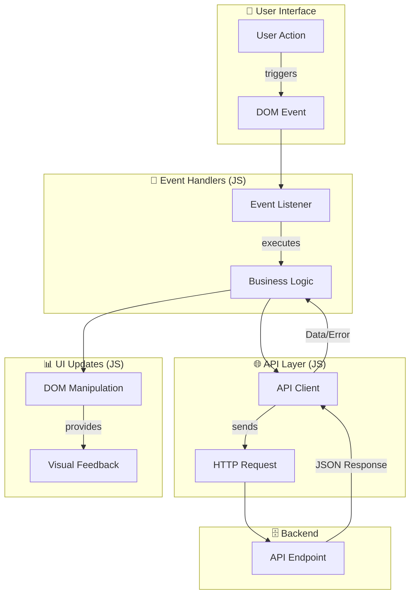

# Arquitectura JavaScript

Este documento detalla los patrones de organización del código JavaScript, la comunicación con APIs y la gestión de estado para el frontend.

## 📋 Índice

1. [Estructura de Archivos JavaScript](#estructura-de-archivos-javascript)
2. [Patrones de Organización JavaScript](#patrones-de-organización-javascript)
3. [Patrones de Comunicación con APIs](#patrones-de-comunicación-con-apis)
4. [Gestión de Estado](#gestión-de-estado)
5. [Flujo de Datos Frontend](#flujo-de-datos-frontend)
6. [Patrones de Diseño Frontend](#patrones-de-diseño-frontend)

---

## 1. Estructura de Archivos JavaScript

```
static/js/
├── messages.js                  # 🔧 Sistema de mensajes estandarizados
├── module_a/                    # 💰 JavaScript módulo A
│   ├── utils.js                 # Utilidades compartidas del módulo
│   ├── dashboard/
│   │   └── main.js              # Lógica del dashboard
│   └── feature_1/
│       ├── main.js              # Lógica principal de la funcionalidad
│       ├── handlers.js          # Manejadores de eventos
│       └── ui.js                # Manipulación UI
└── module_b/                    # 🎤 JavaScript módulo B
    ├── content/
    │   ├── main.js              # Punto de entrada
    │   ├── handlers.js          # Lógica de negocio
    │   └── ui.js                # Manipulación UI
    └── queries/
        ├── main.js              # Gestión de consultas
        └── ui.js                # Interfaz de usuario
```

---

## 2. Patrones de Organización JavaScript

#### Patrón Modular ES6+

**Características:**
- **Imports/Exports**: Uso de módulos nativos ES6 para una clara separación de dependencias.
- **Separación de Responsabilidades**: Archivos especializados por función (UI, Handlers, Main).
- **Reutilización**: Funciones y clases exportables para ser usadas en diferentes partes del módulo.

#### Estructura de Módulos

##### Módulo Principal (`main.js`)
Punto de entrada que inicializa la lógica del módulo, bindea los eventos principales y realiza la carga inicial de datos.

```javascript
// Ejemplo: module_b/content/main.js
import { loadData, importData } from './handlers.js';
import { cleanupModalState } from './ui.js';

document.addEventListener('DOMContentLoaded', function() {
    cleanupModalState();
    
    document.getElementById('refreshBtn').addEventListener('click', loadData);
    document.getElementById('importBtn').addEventListener('click', importData);
    
    loadData();
});
```

##### Manejadores de Eventos (`handlers.js`)
Contiene la lógica de negocio, las llamadas a la API y la manipulación del estado de la aplicación.

```javascript
// Ejemplo: module_b/content/handlers.js
import { showToast, displayData } from './ui.js';
import { ApiClient } from '../api.js'; // Asumiendo un cliente API reutilizable

export async function loadData() {
    try {
        const response = await ApiClient.get('/api/module_b/content');
        if (response.success) {
            displayData(response.data);
        } else {
            showToast('error', response.message);
        }
    } catch (error) {
        showToast('error', `Error de conexión: ${error.message}`);
    }
}
```

##### Manipulación UI (`ui.js`)
Encargado exclusivamente de la manipulación del DOM, como renderizar datos, mostrar/ocultar elementos y presentar feedback visual.

```javascript
// Ejemplo: module_b/content/ui.js
export function showToast(type, message) {
    // Implementación de toast notifications
}

export function displayData(items) {
    const container = document.getElementById('data-container');
    // Lógica para renderizar los items en el contenedor
}
```

---

## 3. Patrones de Comunicación con APIs

#### Patrón Fetch Estandarizado (`ApiClient`)

Para mantener la consistencia y centralizar la lógica de las peticiones HTTP, se recomienda un `ApiClient` estandarizado.

```javascript
export class ApiClient {
    static async request(url, options = {}) {
        const defaultOptions = {
            method: 'GET',
            headers: {
                'Content-Type': 'application/json',
                'X-Requested-With': 'XMLHttpRequest'
            }
        };
        
        const finalOptions = { ...defaultOptions, ...options };
        
        try {
            const response = await fetch(url, finalOptions);
            
            if (!response.ok) {
                const errorData = await response.json().catch(() => ({ 
                    message: response.statusText 
                }));
                throw new Error(errorData.message || `Error ${response.status}`);
            }
            
            return await response.json();
        } catch (error) {
            console.error('API Error:', error);
            throw error;
        }
    }
    
    static async get(url) {
        return this.request(url, { method: 'GET' });
    }
    
    static async post(url, data) {
        return this.request(url, {
            method: 'POST',
            body: JSON.stringify(data)
        });
    }
}
```

---

## 4. Gestión de Estado

Para aplicaciones con estado simple, se puede utilizar un patrón `StateManager` ligero.

#### State Management Pattern
```javascript
class StateManager {
    constructor() {
        this.state = {};
        this.listeners = {};
    }
    
    setState(key, value) {
        this.state[key] = value;
        this.notifyListeners(key, value);
    }
    
    getState(key) {
        return this.state[key];
    }
    
    subscribe(key, callback) {
        if (!this.listeners[key]) {
            this.listeners[key] = [];
        }
        this.listeners[key].push(callback);
    }
    
    notifyListeners(key, value) {
        if (this.listeners[key]) {
            this.listeners[key].forEach(callback => callback(value));
        }
    }
}
```

Para necesidades más complejas, se debe evaluar la incorporación de librerías especializadas como **Zustand** o **Redux Toolkit**.

---

## 5. Flujo de Datos Frontend



---

## 6. Patrones de Diseño Frontend

#### Observer Pattern
**Implementación**: `StateManager` o un `EventEmitter` simple para desacoplar componentes. Un componente puede "emitir" un evento (ej. `item:updated`) y otros pueden "escuchar" ese evento para reaccionar sin estar directamente acoplados.

```javascript
class EventEmitter {
    constructor() { this.events = {}; }
    on(event, cb) { (this.events[event] = this.events[event] || []).push(cb); }
    emit(event, data) { if (this.events[event]) this.events[event].forEach(cb => cb(data)); }
}
```

#### Factory Pattern
**Implementación**: Para la creación de componentes UI dinámicos, como modales o toasts, centralizando su lógica de construcción.

```javascript
class ComponentFactory {
    static createToast(type, message) {
        const toastEl = document.createElement('div');
        // ... configuración del toast
        return new bootstrap.Toast(toastEl);
    }
}
```

#### Strategy Pattern
**Implementación**: Para seleccionar diferentes maneras de visualizar datos (ej. tabla, tarjetas, lista) sin cambiar la lógica que obtiene los datos.

```javascript
const displayStrategies = {
    table: (data, container) => { /* renderiza una tabla */ },
    cards: (data, container) => { /* renderiza tarjetas */ }
};

function renderData(data, container, strategy = 'table') {
    displayStrategies[strategy](data, container);
}
``` 